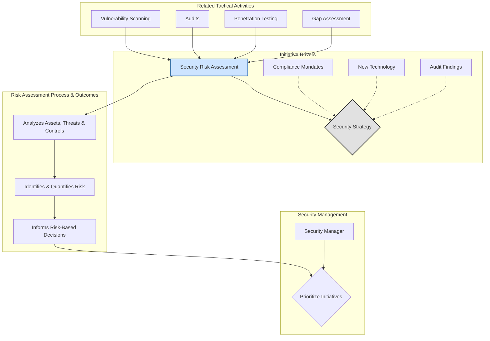

# Chapter 1: Introduction

***

### High-Level Concept Overview

### Executive Summary

This week introduces the foundational role of the Information Security Manager and the critical function of security risk assessment. The core challenge for any security leader is prioritizing security initiatives amid limited resources. While drivers like audits, technology trends, or compliance mandates can influence security strategy, they are often reactive and incomplete. A truly robust security posture is built upon a proactive, risk-based approach. The cornerstone of this approach is the **Security Risk Assessment (SRA)**, a systematic process to identify, analyze, and evaluate risks to an organization's information assets. A quality SRA enables informed, justifiable decisions and provides numerous secondary benefits, including enhanced security awareness and improved communication. It is crucial to distinguish a comprehensive SRA from related but more narrowly focused activities like penetration testing or compliance audits, which often serve as inputs to the broader risk assessment process.

### Key Concepts

#### The Role and Responsibilities of the Information Security Manager

The Information Security Manager is the key figure responsible for safeguarding an organization's information assets. While the exact structure of this role can vary between organizations, the core responsibilities are consistent and multifaceted. They include:

*   Preventing financial loss, fraud, and breaches of sensitive data.
*   Demonstrating and maintaining compliance with relevant regulations and industry standards.
*   Developing, implementing, and managing security policies and procedures.
*   Ensuring business continuity and planning for incident and disaster response.

Perhaps the most critical and persistent responsibility is to **prioritize security initiatives**. Given that funding, staffing, and time are always finite, the security manager must be able to determine which security projects will provide the most value and effectively defend these decisions to senior leadership.

#### Drivers for Security Initiatives

Organizations often arrive at their security strategy through various influences. Understanding these drivers is key to recognizing their limitations and advocating for a more comprehensive approach.

*Caption: Common drivers that shape an organization's security strategy, each with inherent limitations.*

*   **Audit-Driven Strategy:** When audit findings are the primary driver, the security program becomes inherently reactive. Audits review past performance against existing policies. A strategy based solely on fixing audit findings is always playing "catch-up" and fails to address emerging threats or areas not yet covered by policy.

*   **Technology-Driven Strategy:** The constant stream of new security products from vendors can be tempting. While technology is a vital component of security, a strategy that relies too heavily on technological solutions will neglect critical administrative and physical controls, leaving significant gaps in the overall security posture.

*   **Compliance-Driven Strategy:** Using regulations (like HIPAA or PCI DSS) as the foundation for a security strategy seems logical, but it is insufficient. Compliance requirements represent a baseline, not a comprehensive security framework. This approach can lead to a "silo" mentality, where efforts are duplicated for each regulation. Furthermore, regulations often lack specific implementation guidance and do not account for an organization's unique business mission or customer requirements.

A more complete and effective strategy is one based on a formal analysis of security risk.

#### The Security Risk Assessment (SRA)

A Security Risk Assessment (SRA) is the cornerstone of a mature security program. It provides the analytical foundation needed to move from a reactive to a proactive security posture.

**Definition and Need**
While formal definitions exist from bodies like NIST and ISO, an SRA can be summarized as:

> A probability determination of asset losses based on an analysis of asset valuation, relevant threats, and an objective review of the effectiveness of current security controls.

The primary need for an SRA is to enable **risk-based spending**. It provides the data to justify security investments by demonstrating how proposed controls will reduce the organization's overall security risk. It also serves as a crucial "check and balance" mechanism, providing a periodic review of how well information assets are being protected in a constantly changing threat and business environment.

**Ensuring a Quality Assessment**
The value of an SRA is directly tied to its quality. A weak or poorly executed SRA can be more dangerous than having no assessment at all, as it can lead to a false sense of security and misallocation of resources.

*Caption: The negative consequences stemming from a weak security risk assessment.*

A weak assessment can produce:
*   **False conclusions** about the state of security.
*   **Biased results** that favor certain outcomes or technologies.
*   **Significant planning errors**, leading to wasted effort and budget.
*   Ultimately, an **increase in security risk** due to unaddressed vulnerabilities.

**The Role of the SRA in the Security Lifecycle**
A quality SRA plays an active role throughout the security lifecycle:
1.  **Analysis of Controls:** It systematically analyzes the effectiveness of existing security controls, often using tests like vulnerability scanning or physical walkthroughs.
2.  **Risk Mitigation Planning:** The results inform decisions on how to treat identified risks—whether to accept the risk, reduce it by improving existing controls, or transfer it.
3.  **Operational Security:** It highlights the importance of operational personnel in maintaining security. The findings can be used to develop better awareness and training programs for the staff who operate the security controls daily.

**Secondary Benefits of an SRA**
Beyond its primary function, the SRA process yields significant additional benefits for the organization:
*   **Knowledge Transfer:** The assessment team shares valuable experience and insights with organizational staff.
*   **Increased Communication:** The process inherently fosters dialogue about security among different business units (e.g., HR, Legal, IT).
*   **Heightened Security Awareness:** Activities like interviews and physical walkthroughs naturally test and improve employee security awareness.
*   **Performance Tracking:** The documented list of risks serves as a baseline to track the progress and effectiveness of the information security program over time.

#### Distinguishing the SRA from Related Activities

The term "risk assessment" is sometimes used interchangeably with other security testing activities. However, these activities are typically components or inputs to a comprehensive SRA, not substitutes for it.

*Caption: An SRA is a broad analytical process, distinct from more specific tactical assessments.*

The following table clarifies the definitions and purposes of these related activities:

| Activity | Definition | Purpose |
| :--- | :--- | :--- |
| **Security Risk Assessment** | A comprehensive review of asset value, threats, and control effectiveness to determine the probability of loss. | To provide a holistic, risk-based foundation for prioritizing all security initiatives. |
| **Gap Assessment** | A review of an organization's security controls against a specific standard or framework. | To provide a list of controls required to become compliant with that standard. |
| **Compliance Audit** | Verification that all required security controls for a specific regulation are implemented. | To attest to an organization's compliance with a given standard. |
| **Security Audit** | Verification that a specified set of security controls (not necessarily tied to compliance) are in place. | To attest to an organization's adherence to its own policies or industry best practices. |
| **Penetration Testing** | A methodical and planned attack on a system's security controls. | To test the adequacy and real-world effectiveness of security controls against a skilled attacker. |
| **Vulnerability Scanning** | A component of penetration testing that uses automated tools to search for known loopholes. | To quickly test for the existence of common or obvious vulnerabilities. |
| **Ad Hoc Testing** | A search for less obvious vulnerabilities performed by security experts using advanced techniques. | To discover complex or novel vulnerabilities that automated tools might miss. |
| **Social Engineering** | An assessment of human-related security controls by attempting to gain unauthorized access via manipulation. | To test the effectiveness of security training and procedures by targeting the human element. |

### Key Takeaways

*   The primary role of an Information Security Manager is to protect assets by effectively prioritizing security initiatives with limited resources.
*   Relying on single drivers like audits, technology, or compliance leads to a reactive and incomplete security strategy.
*   A Security Risk Assessment (SRA) provides the most comprehensive and proactive foundation for making justifiable, risk-based security decisions.
*   The quality of an SRA is critical; a weak assessment can create a false sense of security and lead to significant planning errors.
*   An SRA is a broad, analytical process that is distinct from, but often incorporates, more tactical activities like penetration testing, vulnerability scanning, and audits.