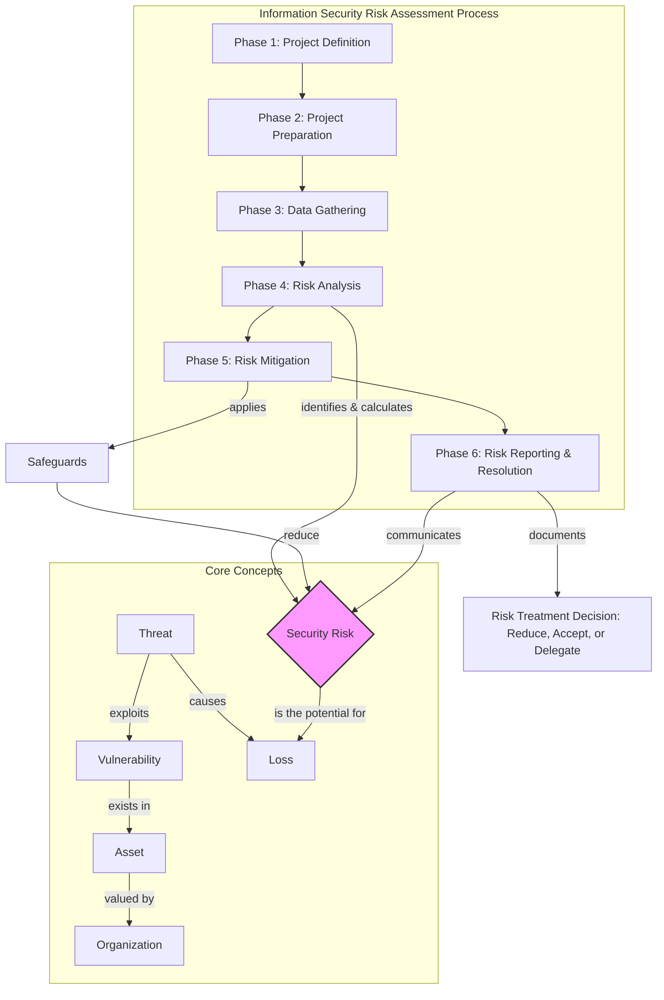

# Chapter 2: Information Security Risk Assessment Basics

***

### High-Level Concept Overview

### Executive Summary

Information security risk assessment is a formal, objective process used to analyze the effectiveness of an organization's security controls and determine the probability and potential impact of losses to its critical assets. While numerous methodologies exist, they all follow a similar lifecycle: defining the project scope, preparing the team and logistics, gathering administrative, technical, and physical data, analyzing the data to identify and calculate risks, proposing mitigation strategies (controls), and finally, reporting the findings to stakeholders for resolution. The ultimate goal is to provide senior management with clear, actionable information to make informed decisions about how to treat identified security risks, whether by reducing, accepting, or delegating them.

### Key Concepts: The Risk Assessment Process

An information security risk assessment is a structured project. Its success depends heavily on effective project management and a clear understanding of its distinct phases.

*This diagram illustrates a common breakdown of the risk assessment process, highlighting the distinct types of data gathering required to build a complete picture of an organization's security posture.*

#### Phase 1: Project Definition

This initial phase is critical for establishing a solid foundation for the entire assessment. It's about setting clear expectations and boundaries. Key activities include:

*   **Scoping:** An agreement must be reached on the scope and content of the final deliverables. This includes defining:
    *   **Budget and Time Frame:** The project's cost and schedule constraints must be clearly understood and documented.
    *   **Project Plan:** The overall project is broken down into manageable tasks, with resources allocated to each.
*   **Assessment Objective:** The purpose of the assessment must be explicit. Is it for regulatory compliance, a general program review, or in response to an incident? The objective shapes the entire process.
*   **Assessment Boundaries:** Clarity is needed on what is "in-scope" versus "out-of-scope." This involves identifying the specific:
    *   **Assets:** Critical information, systems, and infrastructure to be assessed.
    *   **Controls:** The security measures (policies, technologies, procedures) to be evaluated.
    *   **Boundaries:** The physical, logical, or network perimeters of the assessment.

#### Phase 2: Project Preparation

With the project defined, the team must perform logistical and strategic preparations before any data collection begins. This phase ensures the assessment runs smoothly and efficiently.

*   **Team Preparation:**
    *   **Select Team:** Assemble a team with the right mix of skills and experience for the defined scope.
    *   **Introduce Team:** Formally introduce the assessment team to the organization's key personnel to facilitate cooperation.
*   **Project Preparation:**
    *   Obtain formal permission to conduct the assessment.
    *   Review the organization's business mission to understand its core objectives and priorities.
    *   Identify the most critical systems and assets that support this mission.
    *   Map the identified assets to business processes.
    *   Conduct an initial identification of potential threats relevant to the organization.
    *   Determine the expected security controls that should be in place based on industry standards or internal policy.

#### Phase 3: Data Gathering

This is the evidence-collection phase, where the team gathers information about the current state of security. It is typically broken down into three distinct areas to ensure comprehensive coverage.

| Data Gathering Type | Activities                                                                                                                                                                                                                                                                                                                      |
| :------------------ | :------------------------------------------------------------------------------------------------------------------------------------------------------------------------------------------------------------------------------------------------------------------------------------------------------------------------------ |
| **Administrative**  | Focuses on the "paperwork" and human elements of security. It involves reviewing policies, procedures, training materials, and organizational charts. This is often supplemented with interviews with key personnel and direct observation of processes.                                                                          |
| **Technical**       | Focuses on the technology that protects assets. Activities include design and architectural reviews of systems and networks, configuration reviews of servers and devices, and active security testing (e.g., vulnerability scanning, penetration testing).                                                                           |
| **Physical**        | Focuses on the physical security of facilities and assets. This involves reviewing physical access policies and procedures, observing employee behavior (e.g., challenging visitors), and inspecting physical controls like locks, fences, and surveillance systems. |

#### Phase 4: Risk Analysis

In this phase, the raw data gathered is analyzed to identify and quantify risk. This involves connecting assets, threats, and vulnerabilities.

*   **Core Concepts:**
    *   **Asset:** A tangible or intangible item of value to the organization. Assets must be identified and valued to understand the potential impact of a loss. Asset valuation helps scope the assessment and determine appropriate countermeasures.
    *   **Threat:** Any potential cause of an unwanted incident, which may result in harm to a system or organization.
    *   **Vulnerability:** A weakness in security controls or system design that could be exploited by a threat. It is often described as the "weakest link."
    *   **Security Risk:** The potential for loss to an organization's asset(s) that will likely occur if a threat is able to exploit a vulnerability. **Risk = Threat x Vulnerability x Asset Value** (conceptually).

*   **Process:**
    1.  **Determine Risk:** Map identified threats to corresponding vulnerabilities for each critical asset.
    2.  **Calculate Risk:** Analyze the likelihood of a threat exploiting a vulnerability and the potential impact (based on asset value) to assign a risk level (e.g., High, Medium, Low).
    3.  **Create Risk Statements:** Formulate clear, concise statements that describe the risk, the affected asset, the threat, the vulnerability, and the potential consequence.
    4.  **Obtain Team Consensus:** The assessment team collaborates to review and agree upon the identified risks and their assigned levels.

#### Phase 5: Risk Mitigation

Once risks are analyzed, the focus shifts to how to reduce them. This involves recommending safeguards, also known as controls.

*   **Safeguards (Controls):** These are measures put in place to reduce risk. They can be categorized by their function:
    *   **Preventative:** Aim to stop an incident from occurring (e.g., firewalls, access control lists).
    *   **Detective:** Aim to identify an incident that has occurred or is in progress (e.g., intrusion detection systems, security audits).
    *   **Corrective:** Aim to limit the damage and restore systems after an incident has occurred (e.g., incident response plans, backups).
*   **Residual Risk:** The risk that remains even after safeguards have been implemented. It is impossible to eliminate all risk; the goal is to reduce it to an acceptable level.

#### Phase 6: Risk Reporting and Resolution

The final phase involves communicating the findings and facilitating a decision-making process.

*   **Reporting:** The team prepares and delivers a final report and presentation to the project sponsor and senior management. The report must be clear and cater to its different audiences:
    *   **Executive:** High-level summary of key risks and business impact.
    *   **Management:** Detailed findings and recommended safeguards.
    *   **Technical:** Specific vulnerabilities and configuration details needed for remediation.
*   **Resolution:** Senior management is responsible for deciding how to treat each identified risk. The primary options are:
    *   **Reduce Risk:** Implement the recommended controls to lower the risk.
    *   **Accept Risk:** Formally decide to do nothing, accepting the potential consequences. This is typically done when the cost of the control outweighs the value of the asset or potential loss.
    *   **Delegate Risk:** Transfer the risk to another entity, most commonly through insurance or by outsourcing the function.
    The final decision for each risk must be formally documented.

### Key Takeaways

*   A security risk assessment is a systematic analysis of security controls and the probability of loss to organizational assets.
*   The process is a structured project that requires clear definition of scope, objectives, budget, and timelines.
*   Data gathering must be comprehensive, covering administrative (people, policies), technical (systems, configurations), and physical (facilities, access) domains.
*   Risk is the intersection of a valuable **asset**, a potential **threat**, and an exploitable **vulnerability**.
*   The goal of risk analysis is to produce clear risk statements that enable informed decision-making.
*   Risk mitigation involves applying safeguards (preventative, detective, corrective) to reduce risk to an acceptable level, known as residual risk.
*   The ultimate outcome is a documented resolution from senior management on how to treat each identified risk: reduce, accept, or delegate.