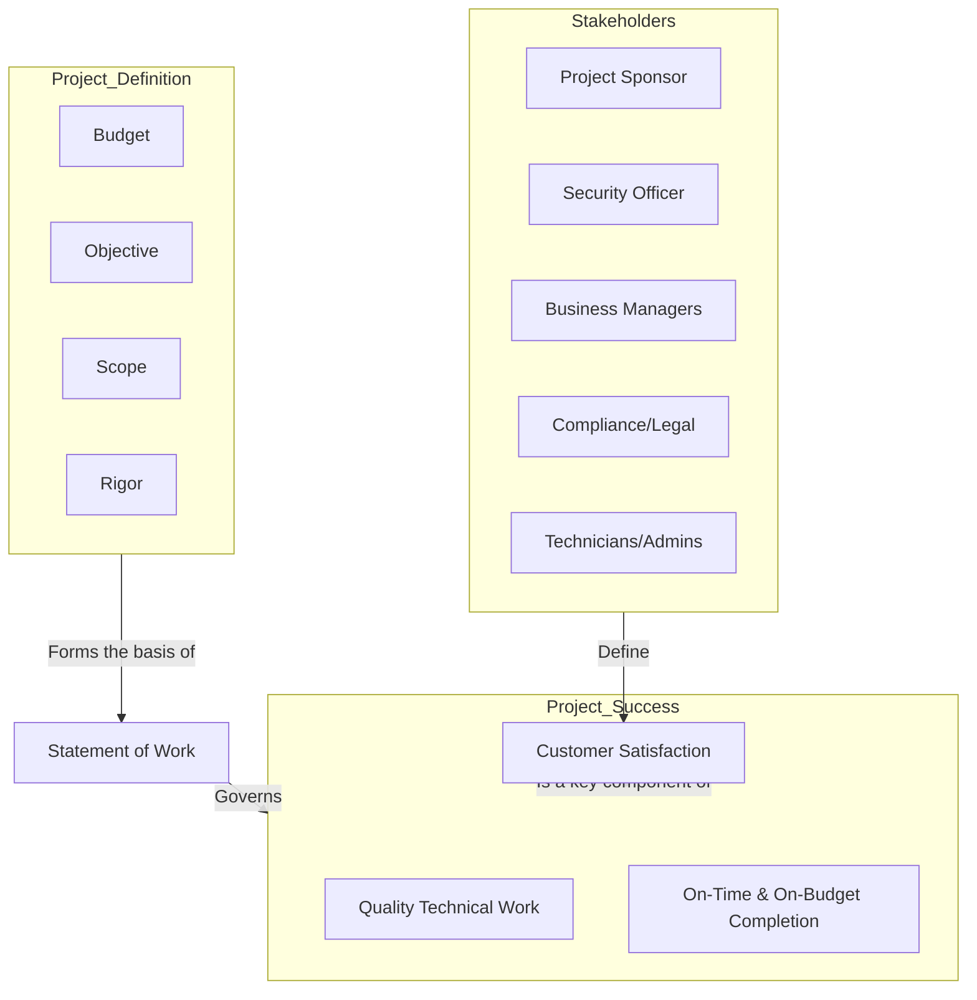

# Chapter 3: Project Definition

***

### **High-Level Concept Overview**

### **Executive Summary**

A security risk assessment is an objective analysis of an organization's security controls and the probability of loss to its assets. Before any assessment activities begin, the project must be meticulously defined to prevent confusion and ensure a valuable outcome. This definition process involves establishing a clear objective, scope, budget, and expected level of analytical rigor. Success is not merely technical; it is a combination of high-quality work, completion within time and budget constraints, and satisfying the needs of all project stakeholders, from the primary sponsor to the technical teams. All these defined parameters are formalized in a Statement of Work (SOW), which serves as the foundational agreement for the entire engagement.

### **Key Concepts**

#### **Defining a Security Risk Assessment**

At its core, a **security risk assessment** is an objective analysis of the effectiveness of the current security controls that protect an organization's assets and a determination of the probability of losses to those assets.

It's crucial to recognize that terminology in this field can be inconsistent. Terms like *security audit*, *risk assessment*, and *security testing* are often used interchangeably, while at other times they refer to distinct activities. Because of this ambiguity, a clear, agreed-upon project definition is the first and most critical step.

#### **Ensuring Project Success**

A security risk assessment is a project, and its success hinges on more than just technical findings. Success is a three-part concept:

1.  **Customer Satisfaction:** Meeting the expectations of all stakeholders.
2.  **Quality Technical Work:** Delivering accurate, thorough, and actionable analysis.
3.  **Completion Within Budget:** Adhering to the agreed-upon financial and time constraints.

##### **Customer Satisfaction & Identifying Stakeholders**

Achieving satisfaction requires first identifying who the "customers" or stakeholders are. Each has a unique perspective and set of expectations for the assessment.

*   **Primary Customer (Project Sponsor):** This is the individual who commissions the assessment, holds signature authority for contracts, and is ultimately responsible for the project's success. They are primarily concerned with the overall quality of the work and adherence to budget and schedule. For an internal assessment, this is typically the department manager or director who initiated the project.
*   **Secondary Customers (Stakeholders):** Their buy-in is vital for the acceptance and implementation of the assessment's findings.
    *   **Security Officer or Team:** May be the project sponsor, but is always a key stakeholder concerned with the technical accuracy and practical recommendations for improving the organization's security posture.
    *   **Business Unit Managers:** View the assessment through the lens of business operations. They want to ensure security controls don't impede productivity and that risks to their specific business processes are addressed.
    *   **Compliance Officer / Legal Department:** Focused on ensuring the organization meets legal, statutory, and regulatory requirements (e.g., GDPR, HIPAA, PCI DSS).
    *   **Technicians, Operators, and Administrators:** The "boots on the ground" who implement and manage the systems. They are concerned with the feasibility of recommendations and the impact on their daily workload.

#### **The Four Pillars of Project Definition**

Defining a security risk assessment project requires a careful balance of four key variables. These variables influence the price, timeline, and ultimate value of the assessment.

##### **1. Determining the Objective**

The primary objective is to produce an *accurate analysis of the effectiveness of current security controls*. This involves understanding the relationship between assets, the threats against them, and the vulnerabilities that might be exploited. The assessment methodology chosen (e.g., OCTAVE, CRAMM, FRAP) will guide how this objective is achieved.

*Caption: The fundamental relationship between assets, threats, and vulnerabilities that a risk assessment seeks to analyze.*

##### **2. Setting the Budget**

The budget is a practical constraint that shapes the entire project. Key factors that influence the cost of a security risk assessment include:

*   **Organization Size:** Larger organizations have more assets, systems, and people to assess.
*   **Geographic Separation:** Assessing multiple, geographically dispersed sites adds travel and logistical costs.
*   **Complexity:** Highly complex, interconnected systems require more time and specialized expertise to analyze.
*   **Threat Environment:** An organization facing sophisticated, targeted threats requires a more in-depth assessment than one in a lower-threat environment.
*   **Culture:** An open and cooperative culture can streamline an assessment, while a closed or resistant culture can add time and difficulty.

##### **3. Limiting the Scope**

The scope defines the precise boundaries of the assessment—what will and will not be evaluated. Proper scoping is critical to avoid two common pitfalls:

*   **Under-scoping:** Creating a scope so narrow that the results are not useful or fail to identify significant risks.
*   **Over-scoping:** Creating a scope so broad that it cannot be completed within the given budget and timeline, leading to a shallow, ineffective analysis.

The scope must have clear **logical boundaries**. A system or function might be excluded from the scope for several valid reasons:
*   The function is not security-relevant.
*   The function is already the subject of another, separate assessment.
*   Analysis of the function is beyond the technical skills of the assessment team.
*   Existing physical or environmental controls make a digital function non-security-relevant (e.g., a system in a locked safe with no network connection).

##### **4. Specifying the Rigor**

Rigor refers to the required **depth of analysis**. It answers the question, "How deep do we need to dig?" A high-rigor assessment involves exhaustive testing and detailed analysis, while a low-rigor assessment might be a high-level review. The appropriate level of rigor depends on:
*   **Perceived Strength of Existing Controls:** If controls are believed to be weak, a lower-rigor assessment may be sufficient to identify major flaws. If controls are thought to be strong, a high-rigor assessment is needed to find more subtle weaknesses.
*   **Maturity of the Organization's Security Program:** A mature program may require a highly rigorous assessment to find areas for incremental improvement, whereas a new program may benefit more from a broader, less rigorous assessment to establish a baseline.

---

### **Formalizing the Project: The Statement of Work (SOW)**

The Statement of Work (SOW) is the formal document that captures all the elements of the project definition. It is a critical contract or agreement that specifies what services will be performed. A well-crafted SOW prevents misunderstandings and sets clear expectations.

Key components of an SOW for a security risk assessment include:

| SOW Component | Description |
| :--- | :--- |
| **Service Description** | A clear statement of the project's purpose, such as: "To provide a probability determination of asset losses based on asset valuation, threat analysis, and an objective review of the effectiveness of current security controls." |
| **Scope of Controls** | Specifies which types of security controls are included in the assessment. This should explicitly state whether **administrative**, **physical**, and **technical** controls will be reviewed. |
| **Deliverables** | Details exactly what the customer will receive. This section must be specific. For example, instead of a vague goal like "improve perimeter security," a specific deliverable would be "a recommendation to improve perimeter security through the addition of firewalls on all external interfaces and the development of a DMZ architecture." |
| **Contract Type** | Defines the payment structure. Common types include **Time and Materials (T&M)**, where the customer pays for hours worked, or a **Firm-Fixed Price (FFP)**, where a total cost is agreed upon upfront. |
| **Contract Terms** | May include details on determining needs, selecting a specific risk assessment methodology (e.g., OCTAVE, CRAMM, FRAP), and other project-specific conditions. |
| **Project Membership** | Identifies key personnel from both the assessment team and the client side. Specifying quality and experienced personnel is a key step in ensuring a quality project outcome. |

*Caption: A comprehensive assessment scope often includes administrative, technical, and physical controls.*

### **Key Takeaways**

*   **Definition is Paramount:** A security risk assessment must be clearly defined *before* it begins to ensure its success and utility.
*   **Success is Multifaceted:** A successful project delivers quality technical work, satisfies all stakeholders, and is completed on time and within budget.
*   **Know Your Stakeholders:** Identify the project sponsor and all secondary stakeholders (security, business, legal, technical) to understand and manage their expectations.
*   **Balance the Four Pillars:** Every assessment is a balance of **Objective**, **Scope**, **Budget**, and **Rigor**. Changing one will impact the others.
*   **The SOW is Your Blueprint:** The Statement of Work (SOW) is the official document that formalizes the project definition and serves as the guide for the entire engagement.
*   **Be Specific:** Vague objectives and deliverables lead to disappointing results. Define deliverables in concrete, actionable terms.