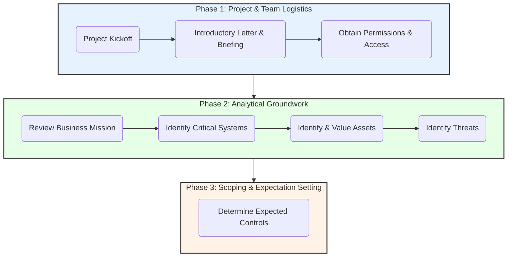

# Chapter 4: Security Risk Assessment Preparation

### High-Level Concept Overview

### Executive Summary

The preparation phase of a security risk assessment is a critical precursor to on-site activities, ensuring the project is efficient, targeted, and professional. This stage is twofold, encompassing both logistical arrangements and foundational analytical work. Logistically, it involves formally introducing the assessment team, establishing points of contact, securing necessary permissions, and arranging for on-site resources. Analytically, the team must gain a deep understanding of the organization's business mission to identify the systems and assets that are most critical to its success. This is followed by a structured process of identifying relevant threats to those assets and establishing a baseline of expected security controls. Successful preparation lays the groundwork for a smooth and effective assessment by aligning the team's efforts with the organization's core objectives and security realities.

### Key Concepts in Security Risk Assessment Preparation

#### 1. Project Initiation and Team Introduction

The initial engagement with the customer organization sets the tone for the entire assessment. A professional and transparent introduction builds confidence and facilitates the cooperation needed for a successful project.

**Introductory Letter & Pre-Assessment Briefing**

A formal introductory letter should be sent to the organization to officially commence the project. This is often followed by a pre-assessment briefing to introduce the team, explain the process, and manage expectations. The introductory letter must contain several key elements:

*   **Points of Contact:** A clear list of contacts for both the assessment team and the customer, including management and technical leads.
*   **Reference to the Statement of Work (SOW):** The letter should reference the specific contract or SOW that outlines the project's requirements.
*   **Project Timeline:** Proposed start and end dates for the overall project, including specific dates for the on-site data gathering portion.
*   **Initial Data Request:** A request for available documentation to minimize time spent on-site. Useful documents include network diagrams, security policies, procedures, and previous risk assessment reports.
*   **On-Site Requirements:** A list of resources the team will need during their on-site visit, such as desks, network access, phones, and physical access credentials.

**Obtaining Proper Permission**

Before any testing or data gathering can begin, the assessment team must obtain explicit, documented permission. This permission must clearly define the scope of the assessment, including which systems can be tested and what methods are authorized. The team will typically require specific user accounts (e.g., administrator, standard user) to evaluate controls from different perspectives.

> **A Note on Assessment Approach:** Security risk assessments rely on open communication and the involvement of the organization's personnel. Their knowledge is essential for effective data gathering. Occasionally, a client may request an "undercover" assessment, where the team operates under a cover story. While this may be useful for specific fraud investigations, it is counterproductive for a general risk assessment, as it prevents the necessary collaboration and information sharing.

#### 2. Reviewing the Business Mission

Before analyzing technical assets, the team must understand what the business does and what makes it successful. The business mission provides the context for determining what is truly critical to protect. Key questions to answer include:

*   Who is the organization's customer?
*   What products or services does the organization provide?
*   What is the organization's unique value proposition or competitive advantage?

Understanding the mission helps connect security efforts directly to business objectives. The information gathered here is often sensitive and its security level must be considered. This review helps define the organization's fundamental security needs.

#### 3. Identifying and Classifying Critical Systems

With an understanding of the business mission, the team can identify the information systems that support it. Each critical system should be considered independently, as it will have unique assets, data, procedures, and controls.

There are three main approaches to determining system criticality:

1.  **Find the Information Elsewhere:** Leverage existing documentation, such as a Business Continuity Plan (BCP) or Disaster Recovery (DR) plan, which likely already identifies and prioritizes critical systems.
2.  **Create High-Level Information:** If no documentation exists, work with senior management to create a high-level list of critical business functions and the systems that support them.
3.  **Classify All Systems:** A comprehensive approach that involves classifying all systems across diverse business units. This is often the most thorough method.

When using the classification approach, systems are evaluated based on two factors:

| Factor | Description |
| :--- | :--- |
| **Protection Requirement** | Based on the an impact analysis, often related to Confidentiality, Integrity, and Availability (CIA). A common method rates systems based on potential financial loss: - **High:** Major financial loss (e.g., > RM1 million). - **Medium:** Significant financial loss (e.g., RM100k - RM1 million). - **Low:** Minor financial loss (e.g., < RM100k). |
| **Mission Criticality** | Based on the system's role in the organization's core function: - **Mission-Critical:** Supports a core business function; its loss would cause immediate business failure. - **Important:** Serves as a backup or its loss would have a significant impact over an extended period. - **Supportive:** Used for organizational convenience; its loss would only impact efficiency. |

#### 4. Identifying and Valuing Assets

Assets are the components of a system that require protection. This includes hardware, software, data, people, and facilities. Identification can be done using checklists and professional judgment. Once identified, assets must be classified and valued to prioritize protection efforts.

**Asset Sensitivity and Criticality Classification**

Similar to systems, asset classification can be approached in three ways:
1.  **Reuse existing information** from asset inventories, previous assessments, or security policies, ensuring the information is current.
2.  **Create new classification information** at a high level if no prior documentation exists.
3.  **Determine asset criticality** by categorizing them:
    *   **Critical Assets:** Required by a critical system with no available backup.
    *   **Important Assets:** Serve as a backup for critical data or have a significant business impact if lost over time.
    *   **Supportive Assets:** Used for convenience; their loss impacts efficiency but not core operations.

**Asset Valuation**

Determining the value of an asset is essential for compliance, budgeting, insurance, and impact analysis. Four qualitative valuation approaches are commonly used:

1.  **Binary Valuation:** A simple "yes" or "no" decision on whether an asset requires protection.
2.  **Classification-Based Valuation:** Value is assigned based on the asset's classification (e.g., all "Critical" assets are assigned a "High" value).
3.  **Rank-Based Valuation:** Assets are ranked in order of importance relative to each other.
4.  **Consensus Valuation:** A group of experts collaborates to reach a consensus on the value of each asset.

#### 5. Identifying Threats

This step bounds the assessment by defining the potential dangers the assets face. It involves identifying both the source of the threat and the negative event it could cause.

**Threat Components**

*   **Threat Agent (or Source):** The entity that could cause harm (e.g., a hacker, a disgruntled employee, an earthquake, a software bug).
*   **Undesirable Event (or Threat):** The negative action or outcome caused by the agent (e.g., unauthorized access, data destruction, system failure).

Threats are often documented as pairings of an agent and an event. For example: A *hacker* (agent) could cause *unauthorized access to customer data* (event).

*This diagram shows how a threat source can exploit a vulnerability to create risk, which in turn leads to a negative impact on the organization.*

Once a list of possible threats is created, threat statements should be validated based on:
*   **History:** Has this type of event happened before?
*   **Environmental Factors:** Are there external conditions (e.g., geographic location, political climate) that make a threat more likely?
*   **Business Factors:** Does the nature of the business (e.g., handling financial data, high public profile) attract certain threats?

#### 6. Determining Expected Controls

The final preparation step involves synthesizing all the information gathered so far—business objectives, critical assets, and relevant threats—to form a preliminary understanding of the controls that *should* be in place. This sets a baseline for the on-site assessment, where the team will evaluate the *actual* controls. Expectations are typically considered in three areas:

*   **Policy Expectations:** Are there adequate policies governing acceptable use, security maintenance, monitoring, etc.?
*   **Organizational Expectations:** Does the security function have the necessary authority, resources, and skilled staff to be effective?
*   **Procedural Expectations:** Are there documented, adequate procedures to implement the policies and manage security controls effectively?

### Key Takeaways

*   **Preparation is Foundational:** The success of a security risk assessment heavily depends on the thoroughness of the preparation phase.
*   **Two-Pronged Approach:** Preparation involves both logistical/administrative tasks (introductions, permissions) and analytical work (understanding the business, assets, and threats).
*   **Start with the Business:** A deep understanding of the business mission is non-negotiable; it provides the context for all subsequent security analysis.
*   **Formalism Builds Trust:** Using formal introductory letters and holding pre-assessment briefings establishes professionalism and ensures all parties are aligned.
*   **Classification is Key:** A structured approach to classifying systems and assets based on criticality and business impact is essential for prioritizing assessment efforts.
*   **Define the Enemy:** Clearly identifying threat agents and the undesirable events they can cause is crucial for scoping the assessment and focusing on relevant risks.
*   **Set Expectations:** The preparation phase should culminate in a clear set of expected controls, which will serve as the benchmark during the on-site evaluation.