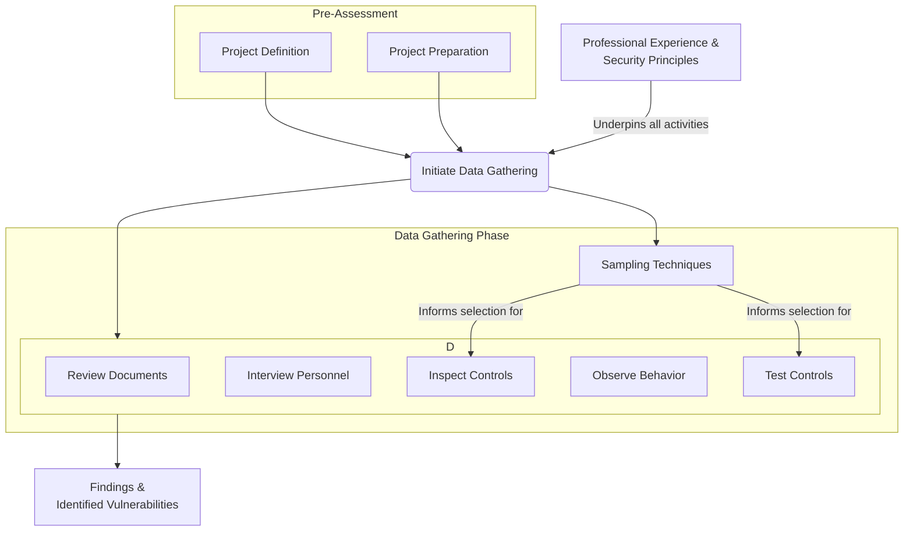

# Chapter 5: Data Gathering

### **High-Level Concept Overview**

### **Executive Summary**

Data gathering is the essential, hands-on phase of a security risk assessment, executed after the system boundaries, assets, and controls have been defined. This process involves a systematic discovery of vulnerabilities by examining security controls within their operational context. Its success hinges on a combination of structured methodology, statistical techniques, and—most importantly—the application of professional experience. A structured approach like the RIIOT method (Review, Interview, Inspect, Observe, Test) ensures comprehensive coverage, while sampling techniques make the assessment of large environments feasible. However, no tool, checklist, or process can replace the critical thinking and developed observational skills of an experienced security engineer who can apply fundamental principles to novel situations.

### **Key Concepts in Data Gathering**

#### **The Foundation: Experience Over Tools**

While checklists and automated tools can guide the data gathering process, they are not a substitute for professional experience. An over-reliance on tools can leave an assessment team unable to react to new or unexpected controls. An experienced security engineer brings two indispensable skills:

1.  **Application of Information Security Principles:** The ability to assess the effectiveness of any security control—even one never seen before—by applying foundational principles like **defense in depth**, **default deny all**, and **separation of duty**. This allows for reliable conclusions where a checklist would fail.
2.  **Developed Observation Techniques:** Seasoned assessors know what to look and listen for. A significant portion of an organization's administrative and physical vulnerabilities can often be identified through a simple walkthrough, as experience has trained the engineer to spot subtle but critical flaws in security posture.

Performing a risk assessment with only a process description and a checklist is a flawed approach. The real value comes from understanding the principles *behind* the checklist items.

#### **The RIIOT Method: A Structured Approach**

The RIIOT method provides a framework to organize the data-gathering effort into distinct, manageable tasks. This ensures appropriate coverage of threats and controls, aids in project management, and makes the process easier to plan, assign, and track.

The five core activities of the RIIOT method are:

1.  **Review Documents:** This involves a critical examination of an organization's security documentation. The review should check for:
    *   **Clarity:** Is the language unambiguous?
    *   **Content:** Does the document contain the necessary information?
    *   **Coverage:** Does it address all expected security elements?
    *   **Gaps:** What required information or controls are missing?

    Key documents to request include security policies, procedures, network diagrams, system configurations, and incident response plans.

2.  **Interview Key Personnel:** Interviews are crucial for confirming information, measuring security culture, and identifying vulnerabilities from the perspective of those who work with the systems daily.

    *   **Objectives:** Confirm threat identifications and asset valuations, verify that procedures are actually followed, gauge staff security awareness, and uncover vulnerabilities specific to the interviewee's area of expertise.
    *   **Process:**
        *   **Preparation:** Select a skilled interviewer, review relevant documents beforehand, and define clear objectives for the interview.
        *   **Execution:** Establish a productive, non-threatening environment. Use a mix of open-ended and closed-ended questions to elicit candid responses. The order and wording of questions are critical.
        *   **Documentation:** The results must be recorded as evidence and shared with the assessment team. A questionnaire can guide the process, but the interviewer must remain flexible.

    
    *This table illustrates how different key personnel across departments hold critical information for a comprehensive assessment.*

3.  **Inspect Security Controls:** This is the hands-on verification of security controls identified in documents and interviews. The goal is to list the controls, verify the information gathered about them, and determine if vulnerabilities exist in their configuration or implementation.

4.  **Observe Personnel Behaviour:** Watching how employees operate provides insight into the real-world effectiveness of security policies. Key areas for observation include:
    *   Adherence to policies and procedures.
    *   Physical security practices (e.g., tailgating, unlocked workstations).
    *   General security awareness.
    *   Proper disposal of sensitive media and hard copies.

5.  **Test Security Controls:** Testing moves from verification to active assessment. It involves technically evaluating a control's effectiveness.
    *   **Types of Testing:** Can range from simple information accuracy checks to more complex **vulnerability testing** (scanning for known weaknesses) and **penetration testing** (simulating an attack).
    *   **Documentation:** All testing activities, system changes, and results must be thoroughly documented to ensure repeatability and provide clear evidence.

#### **Sampling in Data Gathering**

For any large organization, it is impractical to inspect and test 100% of the population (the entire set of items being studied). **Sampling**—testing a representative subset of the population—is used to make data gathering efficient while still allowing for accurate predictions about the whole.

Key statistical concepts used in sampling include:

*   **Confidence Level:** The probability that the findings from the sample are also true for the entire population. A 95% confidence level is standard.
*   **Standard Deviation:** A measure of how spread out the data is from the mean value. It helps in understanding the variability within a data set.

*This table helps determine the minimum sample size needed to achieve statistically significant results, balancing effort against accuracy.*

**Objectives of Sampling:**

*   **Discovery Sampling:** Used when the goal is to find at least one instance of a significant error, fraud, or policy infraction.
*   **Unit Sampling:** Used to determine a specific characteristic or value of the population with a certain degree of confidence.

**Sampling Approaches in Security Testing:**

| Sampling Approach | Description | Advantages | Disadvantages |
| :--- | :--- | :--- | :--- |
| **Representative** | A sample is selected from each distinct group (e.g., one server from each department). | Cost savings and reduction in repetitive data. | May miss unique risks on a non-selected system (e.g., the one externally-facing server wasn't chosen). |
| **Selected** | Areas are intentionally chosen for testing based on perceived risk or importance. | Cost savings and focused effort on high-risk areas. | Findings are only as good as the selection. If the sample is not chosen wisely, major risks can be overlooked. |
| **Random** | Test subjects are chosen based on a truly random selection process. | The test sample is unbiased. | It can be difficult to achieve a truly random sample, and randomness may not focus on the highest-risk areas. |

### **Key Takeaways**

*   Data gathering is a critical discovery phase in risk assessment that builds upon initial project definition and preparation.
*   Human expertise, particularly the ability to apply core security principles and make keen observations, is more valuable than any checklist or tool.
*   The RIIOT method (Review, Interview, Inspect, Observe, Test) provides a comprehensive and organized framework for collecting data and ensuring full coverage.
*   Interviewing is a skill that requires careful preparation and execution to confirm facts, measure awareness, and uncover hidden vulnerabilities.
*   Sampling is a necessary technique for making assessments of large environments manageable. The chosen sampling method must align with assessment goals to avoid overlooking significant risks.
*   All data gathering activities, especially testing and interviews, must be meticulously documented to serve as evidence for the final risk analysis.