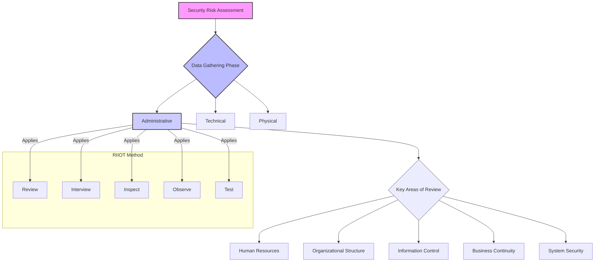

# Chapter 6: Administrative Data Gathering

***

### 1. High-Level Concept Overview

### 2. Executive Summary

Administrative data gathering is a foundational phase of a comprehensive security risk assessment. It focuses on the human and procedural elements of security, evaluating the policies, standards, procedures, and personnel controls that govern an organization's security posture. Unlike technical or physical assessments that deal with systems and facilities, this phase scrutinizes the administrative framework designed to manage risk, ensure compliance, and guide employee behavior. Key areas of review include Human Resources, Organizational Structure, Information Control, Business Continuity, and System Security policies. The **RIIOT (Review, Interview, Inspect, Observe, Test)** method provides a structured approach to systematically collect and analyze data within these administrative domains. A thorough administrative review is critical because even the most advanced technical safeguards can be undermined by weak policies or untrained personnel.

### 3. Key Concepts

Data gathering is a substantial effort within any security risk assessment. To manage this complexity, the process is often divided into three distinct but interconnected areas: **administrative**, **technical**, and **physical**. This allows assessment teams to apply specialized skills and focus their efforts effectively. This section covers the administrative domain.

To effectively gather data, an assessor must understand the relevant threats and the safeguards designed to counter them. Administrative threats often originate from human error, malicious intent from insiders, or failures in governance and procedure.

#### **Areas of Administrative Threats and Safeguards**

The administrative security landscape can be organized into five primary areas for review.

##### **1. Human Resources**

People are often considered the weakest link in security, but they can also be the strongest asset. HR controls are designed to manage the risks associated with personnel throughout their entire lifecycle with the organization.

*   **Recruitment:** This is the first line of defense. Strong recruitment procedures protect the organization from hiring unqualified or untrustworthy individuals.
    *   **Application:** The employment application must collect necessary information and consent to perform background and reference checks.
    *   **Job Requirements:** Hiring managers must create accurate and detailed job descriptions. Vague or incorrect requirements can lead to hiring candidates who are a poor fit for the role, increasing the risk of error or abuse.
    *   **Reference Checks:** Both professional and personal references help verify an applicant's skills, experience, and character.

*   **Employment:** Once an individual is hired, a different set of controls applies to manage their access and behavior.
    *   **Policies & Training:** Employees must be made aware of security policies, such as the **Acceptable Use Policy (AUP)**, through regular training and education programs. Clear job descriptions ensure they understand their specific responsibilities.
    *   **Performance Management:** Annual reviews provide an opportunity to assess an employee's adherence to policies and performance of security-related duties.
    *   **Controlling Access & Opportunity:** Several principles are used to limit the potential for abuse:
        *   **Monitoring:** The organization should monitor employee activities to the extent permitted by policy and law to detect unauthorized actions.
        *   **Separation of Duties:** A critical control where a single task is broken into parts performed by different individuals to prevent any one person from having end-to-end control. For example, the person who requests a payment cannot be the same person who authorizes it.
        *   **Dual Control:** Requires two individuals to be present and cooperate to perform a sensitive task (e.g., accessing a safe deposit box).
        *   **Job Rotation:** Periodically moving employees between different job roles. This reduces the risk of long-term fraud and provides cross-training, which is also beneficial for business continuity.

*   **Termination:** When an employee leaves, procedures must be in place to revoke access and protect sensitive information promptly.
    *   **Termination Procedures:** A formal, documented process for disabling all physical and logical access, returning company assets, and conducting an exit interview.
    *   **Legal Agreements:** Non-Disclosure Agreements (NDAs) and non-compete clauses legally obligate former employees to protect confidential information even after they leave.
    *   **Out-Briefing:** An exit interview (out-briefing) is used to remind the departing employee of their ongoing confidentiality obligations.

##### **2. Organizational Structure**

A robust security program cannot exist without clear direction and support from the top. The organizational structure defines roles, responsibilities, and the authority needed to implement and enforce security.

*   **Senior Management:** Leadership sets the tone for security. Their key responsibilities include:
    *   Defining the organization's risk tolerance.
    *   Assigning duties and providing the necessary budget and staff for the security program.
    *   Ensuring that delegated security responsibilities are clearly understood and accepted.

*   **Security Program:** The formal security program requires:
    *   Clearly assigned duties for all members.
    *   Sufficient authority and visibility to perform security activities effectively.
    *   A budget to acquire necessary tools and expertise.
    *   A process for periodic risk analysis and reporting to senior management.
    *   Regular reviews of security activities to ensure effectiveness.

*A conceptual model of how security directives flow from high-level policy down to operational procedures, ensuring alignment with management's risk tolerance.*

*   **Security Operations:** This is the team responsible for the day-to-day implementation of security controls.
    *   They operate based on established policies and maintenance procedures.
    *   Key principles guiding their work include **least privilege** (granting employees the minimum access required to do their jobs) and separation of duties.
    *   They conduct monitoring and support audit functions.

*   **Audit:** Independent verification is crucial for ensuring controls are working as intended.
    *   **Internal Audit:** An internal group that reviews controls for compliance and effectiveness.
    *   **Third-Party Review:** An external assessment (e.g., by a security consulting firm) that provides an unbiased view of the security posture.
    *   **Security Risk Assessment:** The formal process of identifying, analyzing, and evaluating risk, which itself is a form of audit.

##### **3. Information Control**

This area focuses on the policies and procedures for managing access to information and the assets that store or process it.

*   **User Accounts & Access:**
    *   **Need to Know:** A principle that complements least privilege. Users should only have access to the specific information necessary to perform their duties.
    *   **Access Control Procedures:** Formal processes for creating user accounts, reviewing access rights periodically, and terminating access upon role change or departure are essential.

*   **Asset Control:** You can't protect what you don't know you have.
    *   **Asset Inventory & Tracking:** Maintaining a detailed inventory of all critical hardware, software, and data assets.
    *   **Information Classification:** A **criticality analysis** should be performed to classify information based on its sensitivity (e.g., Public, Internal, Confidential, Restricted). This classification dictates the level of protection required. Information should be physically or digitally labeled according to its classification.
    *   **Media Handling:** Procedures for the secure destruction or sanitization of media (e.g., hard drives, backup tapes) that once held sensitive information are critical to prevent data leakage.

##### **4. Business Continuity**

This involves planning for disruptions to ensure the organization can continue its critical functions. It is a fundamentally administrative process of identifying threats, analyzing their potential impact, and creating strategies to ensure resilience.

*   **Contingency Planning:** This is the umbrella term for long-term strategic planning.
    *   **Business Continuity Plan (BCP):** The long-term strategy focused on keeping the business operational during a disaster.
    *   **Business Impact Analysis (BIA):** The foundational analysis that identifies critical business functions and determines the maximum tolerable downtime for each.
    *   **Disaster Recovery Plan (DRP):** The near- and mid-term tactical plan for recovering IT systems and infrastructure after a disaster.
    *   **Data Backup:** A critical component of the DRP, involving regular backups and secure offsite storage.
    *   **Testing and Maintenance:** Plans must be regularly tested (e.g., tabletop exercises, full simulations) and updated to remain effective.

*   **Incident Response Program:** This program focuses on reacting to security incidents (e.g., cyberattacks, data breaches).
    *   **Incident Response Plan (IRP):** A formal plan that details the procedures for detecting, responding to, and recovering from security incidents.
    *   **Training & Expertise:** The incident response team must be well-trained, and the organization should have access to external experts if needed.

##### **5. System Security**

While system security involves technical controls, the administrative component deals with the policies and procedures that govern how those systems are managed and secured.

*   **System Controls:**
    *   **Operating Procedures:** Documented procedures for server hardening, vulnerability scanning, and patch management (both scheduled and emergency).
    *   **Remote Access:** Strict policies governing remote access to the network, including requirements for multi-factor authentication and secure connections.

*   **Application Security:** Policies to ensure software is developed and maintained securely.
    *   **Secure Coding Standards:** Mandating secure coding practices for in-house developers.
    *   **Reviews and Testing:** Requiring application architecture reviews, code reviews, and penetration testing before deployment.

*   **Configuration Management:** A formal process to manage and control changes to system configurations.
    *   **Configuration Items (CI):** Identifying unique work products (e.g., a server build, a firewall ruleset) that must be controlled.
    *   **Change Control:** Ensuring all changes to CIs are formally reviewed, approved, tested, and documented. This prevents unauthorized changes that could introduce vulnerabilities.

*   **Third-Party Access:** Managing risks associated with vendors, partners, and contractors.
    *   **Contractual Agreements:** Legal contracts should bind third parties to specific security requirements and safeguards.
    *   **Minimum Security Requirements:** The contract should specify minimum controls the third party must have, such as user authentication standards, antivirus software, and firewalls.
    *   **Right to Audit:** The contract should include a clause allowing the organization to review or audit the third party's security controls to ensure compliance.

#### **The RIIOT Method in Administrative Data Gathering**

The RIIOT method provides a framework for how to collect the data related to the administrative controls described above.

| Method    | Description                                                                                                                              | Examples in Administrative Data Gathering                                                                                                                                                                                                                                                                                                                                                                                                                               |
| :-------- | :--------------------------------------------------------------------------------------------------------------------------------------- | :---------------------------------------------------------------------------------------------------------------------------------------------------------------------------------------------------------------------------------------------------------------------------------------------------------------------------------------------------------------------------------------------------------------------------------------------------------------------- |
| **Review**  | Examining an organization's existing documentation to understand its stated policies, procedures, and controls.                        | • Review the information security policy and AUP. • Analyze the Business Continuity Plan (BCP) and Disaster Recovery Plan (DRP). • Read HR documents, including hiring procedures and termination checklists. • Examine past audit reports and risk assessment results. • Study change management logs and incident response reports.                                                                                                                                    |
| **Interview** | Asking targeted questions to key personnel to clarify information found in documents, understand informal processes, and gauge culture. | • Interview the CISO about the security program's budget and authority. • Talk to HR managers about the background check process. • Ask system administrators about patch management procedures. • Interview department heads to assess their understanding of their security responsibilities. • Speak with the BCP coordinator about the last disaster recovery test.                                                                                                |
| **Inspect** | Physically or logically examining security controls and records to verify that they have been implemented as documented.                 | • Inspect training records to verify all new hires have completed security awareness training. • Examine access control lists for a critical server to ensure least privilege is enforced. • Check the visitor logbook at the front desk for completeness. • Inspect asset inventory records for accuracy and completeness. • Verify that terminated employee accounts were disabled in a timely manner by checking system logs.                                          |
| **Observe** | Watching personnel and processes in action to see how security procedures are followed in practice, which may differ from documentation.  | • Observe the new employee onboarding process. • Watch how visitors are handled at reception. • Observe if employees follow the clean desk policy by locking their screens and securing documents. • Sit in on a change control board meeting to see how changes are discussed and approved.                                                                                                                                                                                   |
| **Test**    | Actively testing a control to determine its effectiveness.                                                                               | • Conduct a phishing simulation to test the effectiveness of security awareness training. • Perform a tabletop exercise for the incident response plan. • Attempt to enter a restricted area to test physical access controls managed by administrative procedure. • Submit a fake change request to test the change management process. • Call the help desk and attempt social engineering to test identity verification procedures. |

### 4. Key Takeaways

*   Administrative data gathering is a critical phase of risk assessment focused on policies, procedures, and people.
*   The review of administrative controls is logically structured into five key areas: Human Resources, Organizational Structure, Information Control, Business Continuity, and System Security Policies.
*   The entire employee lifecycle—from recruitment to termination—presents security risks that must be managed with specific HR controls like background checks, training, separation of duties, and formal offboarding.
*   Strong organizational commitment, driven by senior management, is essential for providing the authority, budget, and direction needed for an effective security program.
*   Key security principles like **least privilege**, **need to know**, and **separation of duties** are foundational administrative controls that limit risk.
*   The **RIIOT (Review, Interview, Inspect, Observe, Test)** method provides a comprehensive framework for systematically collecting and verifying information about administrative controls.
*   Documentation alone is insufficient; assessors must verify that policies and procedures are actually implemented and effective through inspection, observation, and testing.