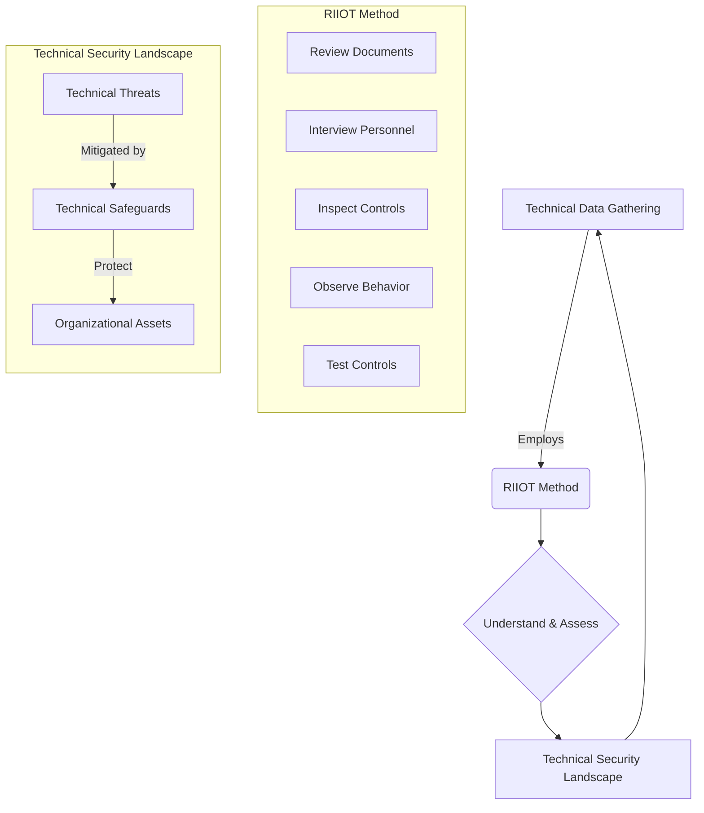

# Chapter 7: Technical Data Gathering

***

### 1. High-Level Concept Overview

### 2. Executive Summary

Technical data gathering is a foundational activity in security risk assessment, requiring an understanding of the specific threats that target an organization's technology infrastructure and the safeguards designed to protect it. This process moves beyond theoretical risk to collect concrete evidence about the actual security posture. A systematic approach, such as the **RIIOT method (Review, Interview, Inspect, Observe, Test)**, provides a structured framework for this task. By reviewing documents, interviewing key personnel, inspecting configurations, observing processes, and testing controls, assessors can verify the effectiveness of safeguards, identify vulnerabilities, and gather the detailed information needed for an accurate and comprehensive risk analysis.

### 3. Key Concepts

An effective risk assessment hinges on a solid understanding of the technical security environment. This involves identifying potential technical threats and the corresponding safeguards in place to mitigate them.

#### **Technical Threats and Safeguards**

Technical threats are those that exploit vulnerabilities in systems, networks, and applications. An assessor must be familiar with common threats and their corresponding safeguards to guide the data gathering process. These can be broken down into several key domains:

**Information Control**

This area concerns the protection of one of the organization's most valuable assets: its data. Controls must address both accidental and malicious actions.

*   **User Error:** Even well-intentioned employees can cause security breaches through mistakes.
    *   **Threats:** Social engineering (tricking users into revealing information), accidental errors, and omissions.
    *   **Safeguards:** Monitoring technology and detailed audit logs can help detect and trace user errors.
*   **Sensitive/Critical Information:** Protecting the confidentiality, integrity, and availability of key data is paramount.
    *   **Threats:** Unauthorized disclosure, modification, or denial of service attacks that make data unavailable.
    *   **Safeguards:** Logical access controls, data encryption, checksums to verify integrity, and anti-virus systems.
*   **User Accounts:** Compromised or overly permissive user accounts are a primary vector for attacks.
    *   **Threats:** Unauthorized disclosure of credentials and excessive privilege (users having more access than they need).
    *   **Safeguards:** Single sign-on (SSO), two-factor authentication (2FA), identity management systems, and automated password policies (enforced with tools like password crackers and generators to test strength).

**Business Continuity**

These controls ensure the organization can continue to operate during and after a disruptive event.

*   **Contingency Planning:** Having a plan to recover from data loss or system failure.
    *   **Threats:** Data disclosure during recovery or permanent unavailability of data.
    *   **Safeguards:** Robust data backup technologies and redundant systems like RAID (Redundant Array of Independent Disks).
*   **Incident Response Program:** A formal plan for reacting to security incidents.
    *   **Threats:** Disclosure of sensitive information during an incident, subversion of systems, or fraud.
    *   **Safeguards:** Forensic analysis tools to investigate incidents without compromising evidence.

*Caption: An incident response program follows a structured lifecycle to ensure threats are contained, eradicated, and learned from.*

**System Security**

This domain covers the security of the underlying operating systems and applications.

*   **System Controls & Application Security:** Securing the core components of the IT infrastructure.
    *   **Threats:** Disclosure, subversion, and fraud through exploitation of system or application vulnerabilities.
*   **Change Management:** Managing changes to systems and applications to prevent introducing new vulnerabilities.
    *   **Threats:** Errors introduced during updates or fraudulent, unauthorized changes.

*Caption: A disciplined change management process, as shown above, is a critical safeguard against introducing errors and vulnerabilities into production systems.*

**Architecture, Components, and Configuration**

This involves the design and setup of the network and its constituent parts.

*   **Architecture:** The high-level design of the network.
    *   **Threats:** Design flaws, denial of service, eavesdropping, and disclosure of internal structure from perimeter network weaknesses.
*   **Components:** Individual devices and systems on the network.
    *   **Threats:** Disclosure of internal structure, network attacks, and denial of service targeting specific components like firewalls or routers.
*   **Configuration:** The specific settings on systems and devices.
    *   **Threats:** Network and application-level attacks exploiting misconfigurations.

**Data Storage and Transit**

*   **Threats:** Unauthorized disclosure or modification of data both when it is stored (at rest) and when it is being transmitted across the network (in transit).
*   **Safeguards:** Encryption for data at rest and in transit (e.g., VPNs, TLS/SSL), and strong access controls for storage systems.

---

#### **The RIIOT Method: A Framework for Technical Data Gathering**

To assess the safeguards listed above, a structured methodology is essential. The RIIOT method provides a comprehensive framework for collecting technical data.

**1. Review Technical Documents**

This is the first step, where the assessor gathers and analyzes existing documentation to understand the intended security posture. This review helps form a baseline and identify areas for further investigation.

*   **Documents to Request:**
    *   Security reports (e.g., previous audits, vulnerability scans)
    *   Technical diagrams (network topology, data flow diagrams)
    *   Technical manuals and design documents
    *   Security policies and standards
*   **What to Look For:**
    *   Alignment with basic security design principles (e.g., defense-in-depth, least privilege).
    *   Identification of security requirements and how they are met in the design.
    *   Common areas for investigation include firewall rule sets, network segmentation, and data encryption standards.

*Caption: Reviewing technical diagrams like this network topology provides a clear picture of the system architecture, connectivity, and potential points of failure or attack.*

**2. Interview Technical Personnel**

While documentation shows how a system *should* work, interviews reveal how it *actually* works. Interviews with technical staff are crucial for verifying information and understanding operational realities.

*   **Challenges:** Technical personnel are often busy and may not be available for long, formal interviews. The goal is to be efficient and focused.
*   **Interview Subjects:** Target the individuals with direct responsibility for the safeguards in question, such as security operations staff, system administrators, and network engineers.
*   **Interview Topics:**
    *   **Security Testing:** How are controls tested? How often? What is the process for remediating findings?
    *   **Security Components:** Discuss the configuration and management of firewalls, intrusion detection systems (IDS), and other key controls.
    *   **Operations & Procedures:** Inquire about daily security tasks, incident response procedures, and patch management processes.

**3. Inspect Technical Security Controls**

Inspection involves directly examining the configuration and settings of security controls to verify they are implemented as documented and are functioning correctly.

*   **Process:**
    1.  **List Controls:** Create a checklist of technical controls to inspect (e.g., firewalls, IDS, anti-spam tools, backup systems).
    2.  **Verify Information:** Systematically go through the list and verify the settings. For example, review firewall rules, check audit log configurations, and inspect the patch level of operating systems and applications.
    3.  **Determine Vulnerabilities:** Identify discrepancies between policy and implementation, misconfigurations, or outdated systems.
    4.  **Document Findings:** Record all observations and findings for the final risk assessment report.

**4. Observe Technical Personnel Behaviour**

This step involves watching technical staff perform their security-related duties. Observation can reveal deviations from documented procedures and uncover informal practices that may introduce risk. For example, observing how a new server is hardened or how a security alert is handled can provide valuable insights that interviews or documentation might miss.

**5. Test Technical Security Controls**

Testing is the most active form of data gathering, where the assessor attempts to validate the effectiveness of a control. This can range from simple checks to complex simulated attacks.

*   **Controls to Test:**
    *   **Monitoring & Logging:** Generate specific events to see if they are logged and if alerts are triggered.
    *   **Access Controls:** Attempt to access resources without proper authorization.
    *   **Network Defenses:** Use scanning tools to test firewall rules and IDS signatures.
*   **Common Testing Methods:**
    *   **Vulnerability Scanning:** Automated tools that scan systems and networks for known vulnerabilities.
    *   **Penetration Testing:** A more in-depth, goal-oriented "ethical hack" where testers simulate a real-world attacker to see if they can breach defenses.

*Caption: Technical testing is not a one-time event but part of a continuous cycle of assessment, remediation, and monitoring to maintain and improve security posture over time.*

### 4. Key Takeaways

*   **Foundation First:** A strong understanding of technical threats (e.g., disclosure, subversion, denial of service) and their corresponding safeguards (e.g., encryption, access controls, firewalls) is essential before beginning data collection.
*   **RIIOT is the Framework:** The RIIOT method (Review, Interview, Inspect, Observe, Test) provides a comprehensive and structured approach to technical data gathering, ensuring all aspects of the technical environment are assessed.
*   **Documentation vs. Reality:** A key goal of technical data gathering is to compare the documented security posture (from policies and diagrams) with the operational reality (discovered through interviews, inspection, and testing).
*   **Data Gathering is Active:** Technical data gathering is not a passive process. It requires active verification through inspection of control settings and testing of their effectiveness.
*   **Categorization is Key:** Organizing threats and safeguards into logical domains (Information Control, Business Continuity, System Security, etc.) helps ensure a thorough and systematic assessment.