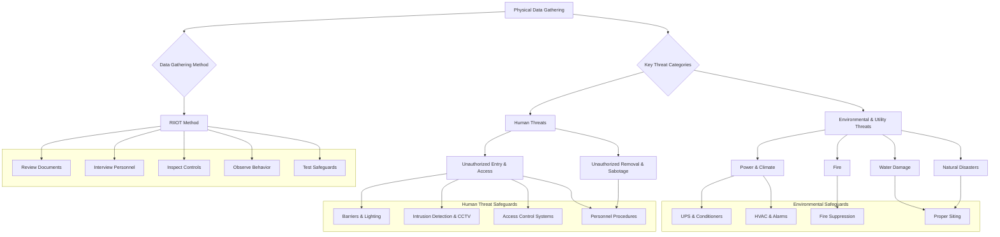

# Chapter 8: Physical Data Gathering

### High-Level Concept Overview

### Executive Summary

A comprehensive security risk assessment must extend beyond logical and network vulnerabilities to include a thorough review of physical security. Ignoring the physical domain creates significant gaps in an organization's defense, potentially leading to breaches of both information and capital assets. This review covers the primary categories of physical threats—environmental/utility and human—along with their corresponding safeguards. The process of collecting this data is structured around the RIIOT method (Review, Interview, Inspect, Observe, Test), a systematic approach to evaluating the effectiveness of physical security controls. Even in organizations where physical and logical security are managed by separate teams, a joint assessment is crucial for achieving a complete and accurate understanding of the overall security posture.

### Key Concepts

#### The Importance and Scope of Physical Security Assessment

A security risk assessment that fails to consider physical vulnerabilities provides a false sense of security. Attackers can bypass sophisticated logical controls by simply gaining physical access to equipment. Therefore, a holistic view requires integrating physical security analysis into the overall assessment.

It is important to define the objective of this assessment. The goal is to analyze the current security controls to identify threats and vulnerabilities, not to conduct a formal inspection for compliance with building codes, fire regulations, or other legal standards. Such inspections require specific licenses and credentials. The focus here is on the practical security posture and making recommendations for its improvement.

#### Environmental and Utility Threats

These threats originate from the surrounding environment and the failure of critical infrastructure systems. They can cause direct damage to assets and create opportunities for other threats to succeed.

**1. Utilities and Interior Climate**

Protected assets, particularly computer systems in data centers, depend on a stable interior climate for continuous operation. Key environmental factors to monitor and control are power, heat, and humidity.

*   **Power:** Consistent and "clean" power is the foundation for all critical systems.
    *   **Threats:**
        *   *Power Loss:* Can be caused by weather, equipment failure, or sabotage, leading to a complete shutdown of operations.
        *   *Degraded Power:* Includes surges, spikes, and sags that can damage sensitive electronic components over time.
    *   **Safeguards:**
        *   *Surge Suppressor:* Protects against voltage spikes.
        *   *Line Conditioner:* Regulates power to provide a "clean" and consistent flow.
        *   *Voltage Regulators:* Maintain a constant voltage level.
        *   *Uninterruptible Power Supplies (UPS):* Provide short-term battery backup power during an outage, allowing for a graceful shutdown of systems or a transition to a generator.

*   **Heat:** Excessive heat can cause system components to fail.
    *   **Safeguards:**
        *   *HVAC Systems:* Heating, Ventilation, and Air Conditioning systems are essential for maintaining an optimal operating temperature.
        *   *Temperature Alarms:* Alert personnel when temperatures exceed predefined thresholds.
        *   *Temperature Logs:* Provide historical data for trend analysis and capacity planning.

*   **Humidity:** Both high and low humidity pose risks. High humidity can cause corrosion, while low humidity increases the risk of electrostatic discharge (ESD), which can destroy electronic components.
    *   **Safeguards:**
        *   *Humidifiers/Dehumidifiers:* Integrated into HVAC systems to maintain optimal humidity levels (typically 40-60%).
        *   *Humidity Alarms & Logs:* Similar to temperature controls, these provide alerts and historical data.

**2. Fire**

Fire presents a catastrophic risk to both personnel and assets.
*   **Impact and Likelihood:** The assessment must consider the potential for fire and its devastating impact.
*   **Safeguards:** A layered approach is necessary.
    *   *Fire Exposure Limitations:* Constructing facilities with fire-resistant materials and storing combustible materials safely.
    *   *Fire Detection Systems:*
        *   *Smoke Detectors:* Detect visible or invisible particles produced by combustion.
        *   *Heat Detectors:* Trigger at a fixed temperature or a rapid rate-of-rise in temperature.
        *   *Flame Detectors:* Sense the infrared or ultraviolet radiation emitted by a fire.
    *   *Control Panels:* Central hub for monitoring detectors and activating alarms and suppression systems.
    *   *Fire Suppression:* Systems can range from portable fire extinguishers to automated systems that use water, clean agents (gases), or other chemicals to extinguish a fire.
    *   *Fire Evacuation:* Clearly marked and practiced evacuation routes and procedures are critical for life safety.

**3. Flood and Water Damage**

Water can be just as destructive as fire. Key considerations for safeguards involve location and planning.
*   **Demographics:** Avoid building critical facilities in known floodplains.
*   **Location of HVAC and Plumbing:** Position air conditioning units, water pipes, and sprinkler systems to minimize the risk of leaks dripping onto computer equipment.
*   **Data Center Location:** Avoid placing data centers in basements. The ground floor or higher is preferable.

**4. Lightning and Other Natural Disasters**

While less frequent, other natural events must be considered based on geographic location.
*   **Lightning:** Can cause massive power surges and electrical outages. Lightning rods and proper grounding are essential safeguards.
*   **Other Disasters:** The risk from earthquakes, volcanoes, landslides, hurricanes, and tornadoes should be evaluated based on regional hazard assessments. Safeguards include structural reinforcement and having well-defined disaster recovery plans.

---

#### Human Threats to Physical Security

This category includes threats from malicious actors (e.g., spies, thieves, saboteurs) and unintentional actions by employees or visitors. The defense strategy is based on layers of controls designed to deter, delay, detect, and respond to unauthorized actions.

**1. Personnel Screening and Procedures**
The first line of defense is ensuring trustworthy personnel. This includes background checks, security awareness training, and clearly defined job roles with enforced separation of duties.

**2. Barriers and Lighting**
These controls are designed to define the perimeter and deter unauthorized entry.
*   **Barriers:** Fences, walls, gates, and vehicle barriers channel personnel to controlled entry points.
*   **Lighting:** Adequate illumination of perimeters, parking lots, and entrances is a powerful deterrent to intruders.

**3. Intrusion Detection**
These systems are designed to detect unauthorized access attempts and trigger an alarm.
*   **Intrusion Detection Sensors:** Include motion sensors, glass-break detectors, and magnetic contacts on doors and windows.
*   **Closed-Circuit Television (CCTV):**
    *   Acts as a deterrent.
    *   Provides real-time surveillance for security staff.
    *   Creates a video record for forensic investigation after an incident.

**4. Physical Access Control**
These are the mechanisms that control entry into a facility or a specific area. The goal is to ensure that only authorized individuals can gain access.
*   **Preventing Unauthorized Entry:** This is achieved by combining identification methods with physical locks.
    *   **Identification Methods:**
        *   *Badges:* Simple photo IDs for visual verification.
        *   *Card Readers:* Use magnetic stripes, proximity cards (RFID/NFC), or smart cards that require a PIN.
        *   *Biometrics:* Authenticate a person based on unique physiological or behavioral traits (e.g., fingerprint, iris scan, facial recognition). Biometrics offer the highest level of assurance.

|  |  |
| :--------------------------------------------------------------------------------------: | :------------------------------------------------------------------------------------------: |
|                     *Card-based access control is common for many facilities.*                      |                     *Biometrics provide a higher level of identity assurance.*                      |

*   **Visitor Controls:** All visitors should be escorted, logged in and out, and issued temporary, easily identifiable badges.

**5. Preventing Unauthorized Removal**
Controlling what leaves the facility is as important as controlling who enters.
*   **Property Pass:** Requires employees to have authorization to remove company property (e.g., laptops) from the premises.
*   **Package Inspection:** Security personnel may inspect bags and packages of individuals entering or leaving the facility to prevent the introduction of contraband or the theft of assets.

---

### The RIIOT Method: A Framework for Physical Data Gathering

The RIIOT method provides a structured approach for the assessment team to collect the necessary data to evaluate physical security controls.

1.  **Review Physical Documents**
    *   Begin by collecting and analyzing existing documentation. This provides a baseline understanding of the intended security posture.
    *   *Examples:* Physical security policies, building blueprints, access control logs, visitor logs, maintenance records for HVAC and fire suppression systems, and past security incident reports.

2.  **Interview Physical Personnel**
    *   Talk to the people who interact with the security controls daily. Their real-world experience is invaluable.
    *   *Examples:* Interview security guards about their patrol routines and incident response procedures. Talk to data center staff about environmental alarms. Interview employees about their understanding of the visitor policy.

3.  **Inspect Physical Security Controls**
    *   Walk through the facility to visually verify that the controls described in the documentation are in place and appear to be in good working order.
    *   *Examples:* Check that fire extinguishers are charged and accessible. Verify that fences are intact and gates are locked. Ensure that CCTV cameras are positioned correctly and are not obstructed.

4.  **Observe Physical Personnel Behaviour**
    *   Watch how people interact with the security systems in a real-world context. This can reveal discrepancies between policy and practice.
    *   *Examples:* Observe if employees hold doors open for others ("tailgating"). Watch the visitor sign-in process to see if it is being followed correctly. Observe guard patrol patterns.

5.  **Test Physical Security Safeguards**
    *   Actively test the controls to ensure they function as expected. This is the most direct way to confirm effectiveness. **Note:** All testing must be approved and coordinated with management beforehand.
    *   *Examples:* Test a motion detector to see if it triggers an alarm. Attempt to enter a restricted area with an invalid badge. Conduct a fire drill to test evacuation procedures and alarm functionality.

### Key Takeaways

*   **Holistic Security:** Physical security is not optional; it is a critical component of a comprehensive risk assessment. Logical and physical security are two sides of the same coin.
*   **Threat Duality:** Physical threats can be broadly categorized as environmental (fire, flood, power failure) and human (theft, sabotage, unauthorized access).
*   **Layered Defense:** Effective physical security relies on a layered defense-in-depth model that aims to deter, delay, detect, and respond to threats. No single control is sufficient.
*   **Location Matters:** The physical location of a facility and the placement of critical assets within it are fundamental security controls against environmental threats like floods and water damage.
*   **People are Key:** Human factors are central to physical security, from personnel screening and training to controlling visitor access and observing employee behavior.
*   **RIIOT Framework:** The RIIOT method (Review, Interview, Inspect, Observe, Test) provides a systematic and comprehensive framework for gathering the data needed to accurately assess an organization's physical security posture.