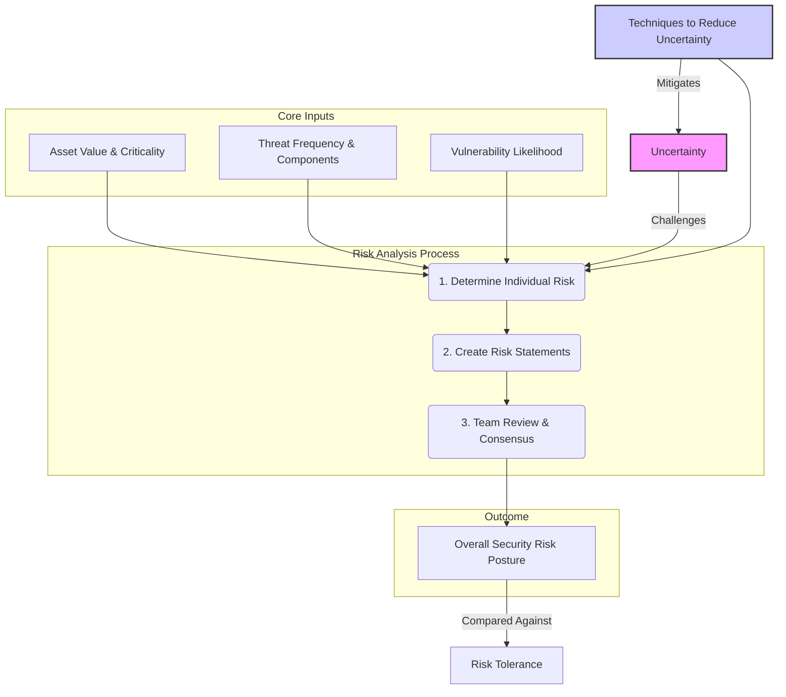

# Chapter 9: Security Risk Analysis

Here are your comprehensive study notes for Week 9: Security Risk Analysis.

***

### Security Risk Analysis: High-Level Overview

### Executive Summary

Security Risk Analysis is the fourth phase of a comprehensive security risk assessment. It synthesizes information gathered in previous stages to determine the level of security risk an organization faces. The core of this phase involves analyzing the relationships between assets, threats, and vulnerabilities to calculate risk, often conceptualized as `Risk = Assets × Threats × Vulnerabilities`. A central challenge in this process is managing the inherent uncertainty in assigning values to these components. Analysts must use various techniques—such as reviewing historical data, applying expert judgment, and using conditional probabilities—to reduce this uncertainty. The findings are documented in formal security risk statements, which are then reviewed by the assessment team to build consensus, group related findings, and derive an overall security risk posture for the organization. This final posture is then compared against the organization's established risk tolerance.

### Key Concepts in Security Risk Analysis

The analysis phase is a structured process designed to move from raw data about threats and vulnerabilities to a clear, actionable understanding of risk. It generally follows three steps: determining individual risks, creating formal risk statements, and conducting a team review.

#### 1. Determining Security Risk

The primary objective here is to determine the risk to specific organizational assets that arises from specific threat/vulnerability pairings. This determination is not a single action but a calculation dependent on several key factors identified during data gathering:

*   The value and criticality of the asset affected.
*   The identified threats and their components (e.g., threat agent, motive).
*   The identified vulnerabilities (administrative, technical, or physical).
*   The probability or frequency of a threat successfully exploiting a vulnerability.
*   The potential impact that exploitation would have on the asset and the organization.

The relationship between these factors is often expressed with the basic security risk equation. While different formal methodologies (like NIST 800-30, OCTAVE, or FRAP) have their own specific formulas and variables, the underlying principle remains the same.

##### The Challenge of Uncertainty

A significant complication in determining risk is uncertainty. The values assigned to asset criticality, threat frequency, and vulnerability likelihood are rarely precise figures; they are estimates based on available information. This means any calculation carries a degree of uncertainty. The question moves from "What is the probability?" to "How confident are we in that probability?"

To proceed, the assessment team must consciously decide how to handle this uncertainty. The two primary options are to either accept the level of uncertainty or take active steps to reduce it.

##### Techniques for Reducing Uncertainty

Several techniques can be employed to refine estimates and reduce the uncertainty surrounding risk calculations.

*   **Review Available and Historical Data:** Looking at past events provides a strong empirical basis for estimating future likelihoods.
    *   **Internal Data:** If an organization experienced three instances of employee theft last year and has not implemented new safeguards, it is reasonable to estimate an **Annual Rate of Occurrence (ARO)** of 3.0 for that threat.
    *   **External Data:** Sources like public crime statistics, analyses from previous assessments, and knowledge of security incidents in related industries can provide valuable context and data points.

*   **Use Expert Judgment (Bounding the Problem):** When hard data is scarce, structured judgment is essential. This involves "bounding" the problem by establishing a range of possibilities.
    1.  First, the team defines a reasonable best-case and worst-case scenario for the impact or likelihood of a risk.
    2.  Once the problem is bounded, the team can develop a probability distribution, assigning likelihoods to various outcomes within that range. For example:

| Loss per Incident | Probability |
| :---------------- | :---------- |
| $1,000             | 10%         |
| $5,000             | 40%         |
| $10,000            | 30%         |
| $20,000            | 20%         |

*   **Use Conditional Probabilities:** Some threats are not single events but a chain of conditional events. By breaking the threat down, the team can estimate the probability of each step, leading to a more accurate overall probability. For example, the risk of a disgruntled terminated employee accessing the network can be broken down:

    *   *Event A:* Employee is terminated.
    *   *Event B:* Employee retains knowledge of critical passwords.
    *   *Event C:* Employee has the desire to cause harm.
    *   *Event D:* Passwords are not changed before the employee attempts access.

    The final probability is the product of the probabilities of each independent event in the chain occurring.

*   **Use Tools:** Various software tools can assist in managing the complexity of these calculations. Spreadsheets like Excel are commonly used, while specialized applications like @RISK, Risk Watch, and MyRAM are designed specifically for risk analysis and can model uncertainty using techniques like Monte Carlo simulations.

#### 2. Creating Security Risk Statements

Once an individual risk has been analyzed, it must be formally documented. A security risk statement is a standardized way to present all the related information about a single risk in a clear and concise format. This ensures that the context and components of the risk are not lost.

These statements are often organized in a spreadsheet or risk register, with columns for each component, effectively capturing the narrative of the risk in a single row:

*   **Asset:** The asset at risk.
*   **Threat/Vulnerability Pairing:** A description of the specific threat and the vulnerability it exploits.
*   **Likelihood:** The calculated probability or frequency of the event.
*   **Impact:** The expected consequence if the event occurs.
*   **Risk Level:** The resulting risk score or level (e.g., Low, Medium, High).

#### 3. Team Review of Security Risk Statements

The final step in the analysis phase is a collaborative review of all the documented risk statements by the assessment team. The goal of this review is to achieve several key outcomes:

*   **Obtain Consensus:** Ensure all team members agree on the analysis, likelihoods, impacts, and final risk levels.
*   **Avoid Overlap:** Identify and consolidate risk statements that describe the same fundamental issue to prevent redundant mitigation efforts.
*   **Group Like Findings:** Cluster related risks together. For example, several risks related to poor password management can be grouped to address the root cause more effectively.
*   **Derive Overall Security Risk:** Synthesize the individual findings into a composite, high-level view of the organization's security risk. This overall risk level must be **consistent with the project's Statement of Work (SOW)** and the qualitative or quantitative scales used for individual risks. This final determination provides an indication of the organization's current security posture in comparison to its **security risk tolerance**.

### Key Takeaways

*   Security Risk Analysis is the analytical engine of a risk assessment, translating data on assets, threats, and vulnerabilities into a coherent picture of risk.
*   The conceptual formula `Risk = Assets × Threats × Vulnerabilities` is the foundation of the analysis, guiding the evaluation of threat/vulnerability pairs.
*   Uncertainty is the biggest challenge in risk analysis; it must be consciously accepted or actively reduced using structured techniques.
*   Methods for reducing uncertainty include analyzing historical data (ARO), bounding the problem with expert judgment, and breaking down complex events using conditional probabilities.
*   Security risk statements are the formal output of the analysis, documenting each risk in a structured format for clarity and review.
*   The team review process is critical for building consensus, refining findings, and deriving an overall organizational risk posture that can be compared to its risk tolerance.