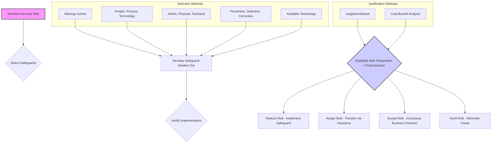

# Chapter 10: Security Risk Mitigation

### High-Level Concept Overview

### Executive Summary

Security risk mitigation is the process that follows risk assessment, focusing on developing and implementing recommendations to reduce identified risks. These recommendations, known as safeguards or countermeasures, are selected using various systematic methods. Often, multiple safeguards are combined into a comprehensive "solution set" to address a single vulnerability from multiple angles. Before implementation, these solutions must be justified, either through professional judgment for clear-cut cases or through a formal cost-benefit analysis. Finally, management must make a strategic decision on how to treat the residual risk, choosing to either reduce it by implementing the safeguards, assign (transfer) it to another party like an insurer, accept it as a cost of doing business, or avoid it entirely by eliminating the source of the risk.

### Key Concepts

#### Selecting Safeguards

Once a security risk assessment has identified vulnerabilities and threats, the next step is to select appropriate safeguards to reduce that risk. The pool of available safeguards is virtually infinite and constantly evolving, so the selection process often relies on the experience of the security team. There are several structured methods to guide the selection of the most effective safeguards.

##### **Methods for Safeguard Selection**

1.  **Missing Control Leads to Implementing Safeguard:** This is the most direct and often obvious method. If a fundamental security control is missing, the logical safeguard is to implement it. This approach is particularly effective for addressing "essential elements" of a security program, especially in organizations with lower security maturity.
    *   **Example:** If an organization lacks a documented incident response plan, the clear recommendation is to create and implement one, as its absence significantly increases the impact of any security breach.

2.  **People, Process, Technology (PPT):** This model provides a systematic framework by categorizing safeguards into three distinct but interconnected areas common in IT.
    *   **People:** Focuses on the human element. Safeguards include hiring qualified and trusted individuals, conducting background checks, and ensuring proper roles and responsibilities.
    *   **Process:** Refers to formal policies, procedures, and practices. Safeguards include security awareness training, formal change management procedures, and regular user account reviews.
    *   **Technology:** Involves the hardware and software used to protect assets. Examples include implementing two-factor authentication, intrusion detection systems (IDS), or email spam filtering.

3.  **Administrative, Physical, Technical:** Similar to PPT, this is another common method for categorizing security controls. It helps ensure comprehensive coverage by considering different types of implementation.
    *   **Example: Password Management**
        *   **Administrative Control:** A policy document stating that all passwords must be alphanumeric and of a certain length.
        *   **Technical Control:** Configuring the system to technically enforce the password policy, preventing users from setting non-compliant passwords.
        *   **Physical Control:** Requiring a physical token or biometric scan (e.g., fingerprint) as part of a multi-factor authentication system, which complements the password.

4.  **Preventive, Detective, Corrective:** This method categorizes safeguards based on their function and timing in relation to a security incident.
    *   **Preventive:** Aims to stop an incident from occurring in the first place (e.g., firewalls, access control lists).
    *   **Detective:** Aims to identify that an incident has occurred or is in progress (e.g., security camera footage, system logs, IDS alerts).
    *   **Corrective:** Aims to limit the damage and restore systems to normal operation after an incident has occurred (e.g., restoring from backups, activating an incident response plan).

5.  **Available Technology:** This approach involves evaluating specific technologies and their capabilities to reduce a security risk. It can provide valuable guidance to the customer on what is currently possible and can help in prioritizing implementation based on effectiveness.
    *   **Example:** When considering biometric authentication, the team might compare the security effectiveness and implementation costs of retina recognition versus thumbprint recognition.

#### Safeguard Solution Sets

A single safeguard is rarely enough to fully address a complex vulnerability. A more robust approach is to develop a **safeguard solution set**, which is a collection of multiple safeguards that work together to provide layered defense. This multi-faceted approach addresses the people, process, and technology aspects of a vulnerability simultaneously.

For example, to address the risk of weak user passwords, a solution set might include:
*   **Modification of the Acceptable Use Policy (AUP)** to formally require users to create and maintain strong passwords (an administrative/process control).
*   **Improvements to Security Awareness Training** to teach users *how* to create strong passwords that are easy to remember but hard to guess (a people/process control).
*   **Regular use of password-cracking software by security staff** to proactively identify and remediate weak passwords in the environment (a technical control).

*Figure 1: A multi-layered safeguard solution set addressing weak password vulnerabilities.*

#### Justifying Safeguard Implementation

Implementing safeguards requires resources—time, money, and personnel. Therefore, every recommended solution must be justified to decision-makers. This justification process involves calculating the full cost of the safeguard and presenting a clear rationale for its implementation.

##### **Safeguard Cost Calculation**
The total cost of a safeguard is more than just its purchase price. A comprehensive calculation includes:
*   **Purchase price:** The initial acquisition cost of hardware or software.
*   **Installation charges:** Costs associated with setup and configuration.
*   **Training costs:** The expense of training staff to use and manage the new safeguard.
*   **Operational costs:** Ongoing expenses required to run the safeguard, such as software licenses or power consumption.
*   **Maintenance costs:** Costs for updates, patches, and support contracts.

##### **Justification Methods**
1.  **Justification through Judgment:** For some safeguards, a formal cost-benefit analysis is unnecessary. Implementation can be justified based on professional judgment in situations where the benefit is clear and obvious.
    *   **Required by law or regulation:** The safeguard is non-negotiable.
    *   **Low cost with material benefits:** The return on investment is self-evident.
    *   **Moderate cost with critical reductions in risk:** The safeguard addresses a severe vulnerability that could have a catastrophic impact.

2.  **Cost-Benefit Analysis (CBA):** For more expensive or complex safeguards, a formal CBA is used to demonstrate that the financial benefits of reducing the risk outweigh the costs of implementation. The key steps include:
    *   Establish a common unit of measurement, typically currency.
    *   Estimate the full costs of the safeguard (purchase, installation, etc.).
    *   Discount future costs and benefits to determine their present-day value.
    *   Compute the final cost-benefit ratio or net benefit.

#### Establishing Security Risk Parameters (Risk Treatment)

After safeguards have been selected and justified, the organization must make a final strategic decision on how to handle the identified risk. This is often referred to as risk treatment. There are four primary options:

| Treatment Option | Description | Example |
| :--------------- | :----------------------------------------------------------------------------------------------------------------------------- | :---------------------------------------------------------------------------------------------------------------- |
| **Reduce Risk** | The most common strategy. The organization chooses to implement the recommended safeguards to lower the risk to an acceptable level. | Installing a web application firewall to protect against SQL injection attacks. |
| **Assign Risk** | Also known as risk transfer. The organization shifts the financial impact of a potential loss to a third party. | Purchasing a cybersecurity insurance policy to cover costs associated with a data breach. |
| **Accept Risk** | A deliberate business decision to not take action against a risk. This is typically done when the cost of mitigation exceeds the potential loss value. | A company decides not to encrypt internal-only, non-sensitive data after calculating the high cost of implementation. |
| **Avoid Risk** | Eliminating the source of the risk entirely. This is the most effective way to deal with a risk but may also mean forgoing a business opportunity. | Shutting down a vulnerable and non-essential service, such as disabling the Telnet protocol on all network devices. |

### Key Takeaways

*   **Mitigation Follows Assessment:** The primary goal of risk mitigation is to select and implement safeguards (countermeasures) to reduce the risks identified during the assessment phase.
*   **Systematic Selection:** Safeguards can be selected using various structured methods, including addressing missing controls, categorizing by People/Process/Technology or Administrative/Physical/Technical, or classifying by function (Preventive, Detective, Corrective).
*   **Layered Defense is Key:** Combining multiple safeguards into a "solution set" is more effective than relying on a single control, as it addresses a vulnerability from multiple perspectives.
*   **Justification is Mandatory:** All proposed safeguards have associated costs and must be justified to management, either through professional judgment for clear cases or a formal Cost-Benefit Analysis (CBA) for more significant investments.
*   **Risk Treatment is a Strategic Choice:** The final decision on a risk is not always to reduce it. Organizations must choose between four options: **Reduce** (mitigate), **Assign** (transfer), **Accept**, or **Avoid** the risk based on their business mission and risk appetite.