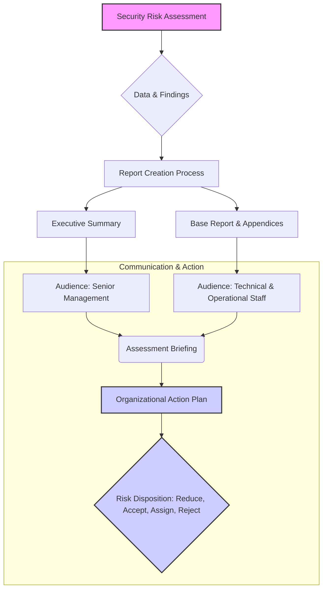

# Chapter 11: Security Risk Assessment Reporting

### High-Level Concept Overview

### Executive Summary

The security risk assessment report is the primary deliverable that communicates the results of the entire assessment effort to the organization. Its objective is to provide senior management with a clear, objective, and actionable analysis of security risks to support decision-making regarding safeguards and risk acceptance. The project is not complete until this information is documented and effectively conveyed. A successful report is perceived as accurate, relevant, nonthreatening, and unambiguous, bridging the gap between technical findings and strategic business decisions. It must be carefully crafted for multiple audiences, including executives, managers, and technical staff, to ensure the findings lead to a concrete action plan that improves the organization's security posture.

### Key Concepts

#### Cautions in Reporting

The tone and framing of a security risk assessment report are as crucial as its technical accuracy. A report can be technically perfect but fail if it alienates its audience. The primary goal is to determine risk and recommend safeguards, not to assign blame.

*   **Avoid Pointing Fingers:** The report should focus on procedural or systemic weaknesses rather than individual failures. This non-judgmental approach encourages cooperation and focuses on solutions.

| Avoid Phrases Like | Instead Use Phrases Like |
| :--- | :--- |
| **Finding:** Administrators in group A failed to properly harden all servers in their area. | **Finding:** Procedures for hardening servers in group A were not completely effective.    **Evidence:** Some servers in group A were not hardened in accordance with the stated policy. |

*   **Avoid Delay in Reporting:** Security findings are often operational, meaning their relevance diminishes over time. A prompt draft report is essential. It's better to deliver a draft for review and correction than to wait for perfection. A significant delay between the assessment activities and the report delivery can make the findings seem irrelevant.

*   **Include Positive Findings:** A report filled exclusively with negative findings can be demoralizing. Highlighting areas where security controls are effective or where staff is performing well provides a balanced view and acknowledges the organization's existing efforts. This also builds goodwill and makes recommendations for improvement more likely to be accepted.

#### Pointers for Quality Reporting

To be effective, a report must be understood by both managerial and technical audiences. This requires a focus on clarity and consistency.

*   **Use Tables and Figures:** Visual aids like tables, charts, and diagrams make complex information more digestible and understandable. They can summarize data, illustrate relationships, and highlight key findings effectively. Every table and figure must be labeled correctly and referenced within the body of the report to provide context.

*   **Use Consistent Terminology:** The field of cybersecurity uses many terms interchangeably (e.g., safeguards, countermeasures, controls). It is critical to choose one term for a concept and use it consistently throughout the report. To avoid confusion, include a "term sheet" or glossary in the appendices to define key technical terms and acronyms used.

#### Report Structure: Designing for a Diverse Audience

A single, monolithic report is rarely effective. The structure should cater to the different needs of its readers, from high-level executives to hands-on technical administrators. A common and effective approach is to create a tiered report.

**1. Executive Level Report**
This is a concise, 2-to-4-page summary designed for senior management. It provides a high-level overview without getting lost in technical jargon.
*   **Key Elements:**
    *   **Purpose of the Assessment:** Why was the assessment conducted?
    *   **Assessment Approach:** A brief overview of the methodology.
    *   **Major Findings:** The most significant risks identified.
    *   **Recommendations:** Clear, high-level recommendations for mitigation.
    *   **Next Steps:** A proposed path forward.
*   **Important Note:** This section should never contain detailed technical information but should make it easy for a reader to locate the detailed analysis in the main report if needed.

**2. The Base Report**
This is the comprehensive document that contains nearly all information gathered during the assessment. It provides the evidence and detailed analysis that supports the executive summary.
*   **Introduction:** Outlines the scope, objectives, and methodology.
*   **Site and System Characteristics:** Describes the organizational and technical environment that was assessed.
*   **Analysis Sections:** Detailed breakdowns of the asset and threat analysis, vulnerability analysis, and the resulting security risk analysis.
*   **Countermeasure Recommendations:** Detailed descriptions of proposed safeguards, including potential costs and benefits.
*   **Appendices and Exhibits:** Supporting documentation that adds credibility and provides necessary detail for implementation.

#### Appendices and Exhibits: Providing the Evidence

Appendices are not just for supplementary information; they are critical for substantiating the report's findings and recommendations.

*   **Resources and Evidence Information:** A list of all evidence used to determine asset values, validate threat statements, and identify vulnerabilities. This provides the necessary backup for the team's conclusions.
*   **Detailed Findings:** This is where raw technical data belongs. For example, the full output from a vulnerability scanner can be included here. This information is invaluable for the administrators tasked with fixing the identified problems.
*   **Cost Estimate Worksheets:** If a cost-benefit analysis was performed, the detailed calculations and estimates for recommended countermeasures are recorded here.
*   **References:** A list of sources cited or used during the assessment.

#### The Reporting Process: A Top-Down Methodology

Creating the report should be a structured, iterative process to ensure quality and accuracy.

1.  **Document Specification:** Before writing, define the report's parameters. This includes identifying the project scope, the target audience, key topics to cover, and any production issues (like format or delivery method).
2.  **Drafting:** Create the first version of the report based on the specification. This draft should be delivered promptly to the customer for an initial review.
3.  **Review and Feedback:** The draft allows for immediate feedback and provides an opportunity for correction. The assessment team and key organizational stakeholders should review the draft to iron out wording, verify factual accuracy, and ensure the report meets its objectives.
4.  **Final Report:** The corrected and approved version of the draft becomes the final report, ready for formal presentation.

#### The Assessment Briefing

The report is often accompanied by a formal presentation or briefing to the organization's senior management. This meeting is a critical opportunity to communicate the findings directly and answer questions.

*   **Preparation is Key:**
    *   Know the attendees and tailor the message accordingly.
    *   Prepare and distribute a clear meeting agenda.
    *   Bring enough copies of the executive summary for everyone.
    *   Ensure all relevant stakeholders (e.g., department heads, IT managers) are invited.
*   **Briefing Tips:**
    *   Use the meeting to resolve any final wording issues from the draft report.
    *   Highlight positive findings first to create a receptive atmosphere.
    *   Keep findings non-judgmental—focus on providing solutions, not assigning blame.

#### The Action Plan: From Report to Remediation

The ultimate goal of the report is to drive action. The organization must create a formal action plan to address the risks identified in the final report. This plan turns recommendations into tangible tasks.

*   Each identified risk must be formally dispositioned:
    *   **Reduce:** Implement the recommended safeguard to lower the risk.
    *   **Accept:** Formally acknowledge the risk and choose not to take action (a valid business decision).
    *   **Assign/Transfer:** Transfer the risk to another party, such as through insurance.
    *   **Reject:** Not a standard risk management term, but in this context could mean formally disagreeing with a finding (which should be rare if the review process was thorough).
*   A strong action plan assigns each item to a named individual, sets a completion date, and includes a mechanism for tracking progress.
*   The disposition of each risk, especially decisions to accept residual risk, should be recorded on a master copy of the report and signed by a senior officer. This creates a formal audit trail for due diligence.

### Key Takeaways

*   **Purpose-Driven:** The report's primary purpose is to enable senior management to make informed decisions about security risk.
*   **Audience-Centric:** Structure the report for different audiences, with a high-level executive summary and a detailed base report for technical staff.
*   **Tone Matters:** Use non-judgmental, blame-free language to encourage cooperation and focus on solutions. Acknowledge positive findings to provide a balanced view.
*   **Clarity and Consistency:** Use visuals to simplify complex data and maintain consistent terminology throughout the document.
*   **Timeliness is Crucial:** Deliver a draft report promptly to maintain relevance and allow for an iterative review process.
*   **Action is the Goal:** The report is only successful if it leads to a formal, tracked action plan where every identified risk is addressed (reduced, accepted, or transferred).