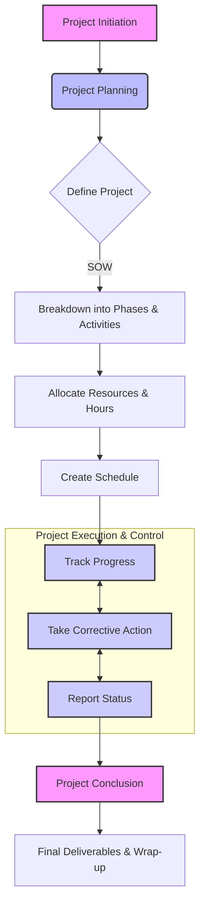

# Chapter 12: Security Risk Assessment Project Management

### **Executive Summary**

A security risk assessment is not merely a technical exercise but a distinct project that demands structured management to be successful. Effective project management ensures the assessment is completed on time, within budget, and to a high standard of technical quality, ultimately satisfying the customer's needs. The core of this process involves four fundamental elements: meticulous **planning**, diligent **tracking** of progress against the plan, decisive **corrective action** when deviations occur, and transparent **reporting** to all stakeholders. This framework guides the project manager from the initial definition of work to the final project conclusion, ensuring that challenges like resource constraints and scope creep are handled effectively.

### **Key Concepts in Security Risk Assessment Project Management**

#### **1. Project Planning**

Successful project completion hinges on thorough planning. The project manager is ultimately responsible for translating the contractual requirements into an actionable plan that balances customer satisfaction, technical quality, budget, and timelines.

**Project Definition**

The foundation of any project plan is the **Statement of Work (SOW)**. This document, part of the contract, formally defines the scope of work, deliverables, deadlines, and resource constraints.

*   The project manager's first task is to thoroughly review the SOW to ensure a complete understanding of all expectations.
*   It is critical to validate that the specified deadlines and resources are realistic and achievable.
*   If any discrepancies or potential problems are identified (e.g., unrealistic deadlines, insufficient budget, unclear deliverables), they must be addressed with senior management immediately, *before* the project formally kicks off.
*   An agreement must be reached on any necessary changes, which might involve amending the SOW or formally acknowledging an expected budget overrun internally. Once the project manager accepts the SOW, they accept responsibility for its successful execution.

**Project Planning Details**

To manage the work effectively, the project is broken down into smaller, more manageable components.

*   **Phases and Activities:** The project is first divided into logical phases. A good rule of thumb is for each phase to last from a few days to a month. This strikes a balance between detailed tracking and manageable overhead. Each phase is then further broken down into specific activities, which typically last from one day to about two weeks.

    
    *A visual representation of the distinct phases in a security risk assessment, which form the basis for detailed project planning and scheduling.*

*   **Scheduling:** Once phases and activities are defined, they must be scheduled. This involves:
    *   Determining start and end times for each activity.
    *   Building in time for reviews (e.g., document reviews).
    *   Identifying the **critical path**—the sequence of tasks that determines the project's total duration. Any delay in a critical path task directly delays the project completion date.
    *   Looking for efficiencies where tasks can be performed in parallel.

*   **Allocating Hours:** Budgeted hours must be carefully assigned to activities. This involves:
    *   **Engineering Estimates:** Using experience to estimate the effort required for each technical task.
    *   **Project Management Hours:** Allocating time specifically for management activities like tracking, reporting, and team coordination.
    *   **Management Reserve:** Setting aside a portion of the budget (e.g., 5-10%) as a contingency fund. This reserve is not allocated to specific tasks but is held by the project manager to cover unexpected problems or delays without immediately needing to request more resources.

**Project Resources and Team Skills**

The success of a security risk assessment is highly dependent on the skills and composition of the team.

*   **Team Composition:** A key decision is whether to use internal staff or external consultants. While internal teams have deep organizational knowledge, external teams may offer greater **objectivity**. It's important to distinguish this from **independence**, which implies a lack of any conflict of interest. A conflict of interest can arise if an assessment team recommends products or services that they also sell.
*   **Essential Skills:** The team needs a blend of technical, consulting, and communication skills.
    *   **Specific Security Risk Assessment Skills:** Team members should possess recognized expertise, often validated by certifications.
        *   **Major Certifications:** CISSP, CISA, CISM, GSEC
        *   **Advanced Certifications:** ISSAP, ISSMP, ISSEP, GIAC
        *   **Vendor-Specific Certifications:** Cisco, Red Hat, etc.
    *   **General Consulting Skills:** Consultants must be sensitive to the organization's culture, bring relevant experience, and focus on delivering real, actionable results rather than generic, "cookie-cutter" solutions.
    *   **General Writing Skills:** The ability to communicate clearly is paramount. Reports should be written for the intended audience (e.g., executives vs. technical staff), avoid a lecturing tone, and present findings and recommendations in a clear, concise manner.

#### **2. Project Tracking**

Once the project is underway, the project manager must continuously track progress against the plan. This allows for early detection of deviations so that corrective action can be taken.

*   **Hours Tracking:** Monitoring the actual hours spent on each task compared to the budgeted hours. This is crucial for managing the project budget.
*   **Calendar Time Tracking:** Comparing the actual start and completion dates of tasks against the planned schedule. This helps identify delays and their impact on the overall timeline.
*   **Project Progress Tracking:** Assessing how much of the work is actually complete. This is often visualized using charts that show the planned progress versus actual progress over time.

*This Earned Value Management (EVM) chart visualizes project health by comparing planned work against actual work completed and costs incurred, immediately highlighting schedule or budget variances.*

#### **3. Taking Corrective Measures**

When tracking reveals that the project is falling behind schedule or going over budget, the project manager must intervene. The goal is to create a plan to bring the project back "in line."

*   **Using Management Reserve:** If the project is behind schedule, the manager can authorize the use of the management reserve hours. This allows the team to work additional hours to catch up without immediately impacting the overall project budget allocated to planned tasks.
*   **Obtaining More Resources:** If the management reserve is insufficient or the problem is larger than anticipated, the project manager may need to formally request additional resources (time, money, or personnel) from senior management. This requires a clear justification explaining the variance and the proposed solution.

#### **4. Project Status Reporting**

Regular and clear communication with all stakeholders is essential. Status reports serve several key purposes: they provide the customer with confidence that the project is progressing well, and they keep senior management and team members informed of the project's health.

*   **Report Frequency:** The frequency of reporting (e.g., weekly, biweekly) depends on the project's length, complexity, and the sponsor's preference.
*   **Report Content:** A good status report is concise but detailed enough to be useful. It should include:
    *   Project name and report date.
    *   **Progress Indication:** A clear, often visual (e.g., red/yellow/green), indicator of the project's overall status.
    *   **Progress This Period:** A summary of accomplishments since the last report.
    *   **Plans for Next Period:** A list of key activities planned for the upcoming period.
    *   **Action Items:** A table tracking open action items, who is responsible, and their due dates.
    *   **Issues/Risks:** A section detailing any current problems or potential risks that could impact the project, along with mitigation plans.

#### **5. Project Conclusion and Wrap-Up**

A project isn't finished until it's formally closed. A defined conclusion is critical to prevent two common problems:

*   **Eliminating 'Scope Creep':** This occurs when the customer continually requests more work that was not in the original SOW. A formal project conclusion provides a clear endpoint, after which any new requests must be handled as a separate engagement.
*   **Eliminating 'Project Run-On':** This happens when team members, particularly perfectionists, don't know when to stop working on a task. A firm deadline and a clear definition of "done" prevent the project from dragging on indefinitely.

### **Key Takeaways**

*   **The SOW is paramount:** The Statement of Work is the project's constitution. Understand it, validate it, and agree to it before starting.
*   **Break it down:** Large projects are managed by breaking them into smaller phases and activities, which allows for accurate scheduling, resource allocation, and tracking.
*   **Plan for the unexpected:** Always include a "management reserve" in your budget and schedule to handle unforeseen issues without derailing the entire project.
*   **Tracking is not optional:** Continuously track hours, schedule, and progress to identify problems early. You can't manage what you don't measure.
*   **Communication is key:** Regular status reports build confidence and ensure all stakeholders are aligned. Be transparent about progress, plans, and problems.
*   **The right team matters:** A successful assessment requires a blend of deep technical security skills, effective consulting practices, and excellent written communication abilities.
*   **Know when to stop:** A formal project conclusion is essential to prevent scope creep and project run-on, ensuring a clean finish.