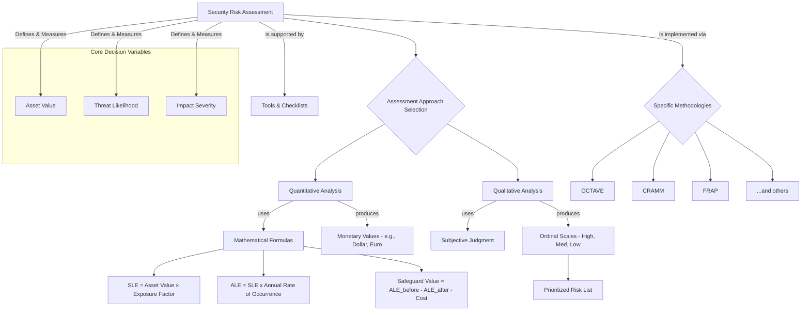

# Chapter 13: Security Risk Assessment Approaches

### **High-Level Concept Overview**

---

### **Executive Summary**

This week focuses on the different approaches to conducting a security risk assessment. The foundational step in any assessment is to clearly define the methodology, as this choice influences the rigor of analysis, data collection techniques, and project phases. The most significant distinction between approaches is the method used to determine key risk variables like asset value, threat likelihood, and impact severity. This leads to the two primary categories of analysis: **quantitative** and **qualitative**.

**Quantitative analysis** uses mathematical formulas to assign monetary values to risk, calculating metrics like Single Loss Expectancy (SLE) and Annualized Loss Expectancy (ALE). This provides objective, data-driven results ideal for cost-benefit analysis and budget justification. However, it can be complex, time-consuming, and create a false sense of precision, especially when historical data is unavailable.

**Qualitative analysis**, in contrast, relies on subjective judgment, using ordinal scales (e.g., High, Medium, Low) to rank and prioritize risks. It is simpler, faster, and more intuitive, making it effective for identifying key problem areas. Its main drawbacks are its subjectivity, which can lead to inconsistent results, and the difficulty in performing a direct cost-benefit analysis or tracking improvements over time.

Ultimately, the choice of approach depends on the organization's specific environment, objectives, and available resources. Various established methodologies like OCTAVE, CRAMM, and FRAP exist to provide structured frameworks for these assessments, often supported by specialized software tools and checklists.

---

### **Key Concepts**

#### **Defining the Assessment Approach**

Before any security risk assessment begins, it is essential to understand and define the specific approach that will be used. There is no single "best" method; the most appropriate choice is driven by the organization's specific context, goals, and resources. Different approaches will vary in their analytical rigor, data collection methods, use of tools, and overall project structure. Understanding the available options allows an organization to continuously improve its assessment process by adopting new techniques or modifying existing ones.

Regardless of the chosen approach, fundamental activities like understanding business objectives, gathering data through document reviews and interviews, and conducting physical walk-throughs remain critical components of a thorough assessment.

#### **Quantitative vs. Qualitative Analysis**

The most fundamental difference between security risk assessment techniques lies in how they determine and compute the core decision variables of risk:

*   **Value of the asset:** What is the asset worth to the organization?
*   **Likelihood:** How likely is it that a threat will exploit a vulnerability?
*   **Severity of impact:** If the event occurs, how severe will the damage be?

The method used to measure these variables defines whether the analysis is quantitative or qualitative.

*   **Quantitative Analysis:** A computational approach that relies on specific formulas and calculations to assign numerical, often monetary, values to risk components.
*   **Qualitative Analysis:** A subjective approach that relies on the judgment and experience of assessors to categorize risk using descriptive or ordinal scales.

##### A Note on Likelihood and Probability
While often used interchangeably, these terms have distinct meanings in risk assessment. **Probability** is a quantitative measure, representing a specific numerical chance of an event occurring (e.g., 0.5 or 50%). **Likelihood** is a qualitative descriptor of this chance (e.g., 'likely', 'unlikely', 'rare').

---

### **Quantitative Analysis**

Quantitative analysis seeks to answer the question, "How much will this risk cost us?" by assigning hard financial numbers to loss. This is achieved through a series of calculations based on the concept of **Expected Loss**. In security, we deal with probabilities, not certainties. Expected loss helps predict the average financial impact of an uncertain event over time.

For example, if you flip a coin where heads wins you RM1 and tails wins you RM2.50, the expected value (or loss for your friend) is calculated as:
Expected Loss = (Probability of Heads × Payout) + (Probability of Tails × Payout)
Expected Loss = (0.5 × RM1) + (0.5 × RM2.50) = RM0.50 + RM1.25 = **RM1.75**

This same principle is applied to security risks.

#### **Key Formulas in Quantitative Analysis**

1.  **Single Loss Expectancy (SLE)**
    The SLE represents the expected financial loss from a *single* adverse event. It is calculated by determining what percentage of an asset's value would be lost.

    `SLE = Asset Value (AV) x Exposure Factor (EF)`

    *   **Asset Value (AV):** The total value of the asset, considering all direct and indirect costs (e.g., hardware replacement, data restoration, lost productivity, reputational damage).
    *   **Exposure Factor (EF):** The percentage of the asset's value that would be lost in a single incident. For example, if a warehouse fire is expected to destroy half the building and its contents, the EF is 0.5 (or 50%).

2.  **Annualized Rate of Occurrence (ARO)**
    The ARO is the estimated frequency with which a specific threat event is expected to occur in one year.
    *   If a computer virus attack happens 6 times per year, the ARO is **6**.
    *   If a major warehouse fire is expected to happen once every 20 years, the ARO is 1/20 = **0.05**.

3.  **Annualized Loss Expectancy (ALE)**
    The ALE extends the SLE to project the expected financial loss over a full year, making it a crucial metric for annual budgeting.

    `ALE = Single Loss Expectancy (SLE) x Annualized Rate of Occurrence (ARO)`

    By calculating the ALE, an organization can prioritize risks based on their annual financial impact.

4.  **Safeguard Value (Cost-Benefit Analysis)**
    This calculation helps determine whether a proposed security control (safeguard) is a worthwhile investment. It compares the reduction in risk (the benefit) to the cost of the control.

    `Safeguard Value = (ALE before implementing safeguard - ALE after implementing safeguard) - Annual Cost of Safeguard`

    A positive result indicates that the safeguard's benefit outweighs its cost.

#### **Advantages and Disadvantages of Quantitative Analysis**

| Advantages                                                              | Disadvantages                                                                                         |
| ----------------------------------------------------------------------- | ----------------------------------------------------------------------------------------------------- |
| **Objective:** Based on formulas, removing subjective judgment.         | **Complex:** Calculations can be difficult to perform and understand, leading to a lack of trust.       |
| **Financial Expression:** Results are in monetary terms, easily understood by management. | **Labor-Intensive:** Requires significant effort to gather data for asset valuation and threat frequency. |
| **Supports Cost-Benefit Analysis:** Provides a clear basis for justifying security investments. | **False Sense of Accuracy:** The precision of the final numbers can mask the uncertainty in the input data. |
| **Credible & Meaningful:** Generates statistics that support budget analysis. | **Difficult Data Acquisition:** Assigning a precise monetary value to intangible assets (e.g., reputation, customer trust) or estimating the ARO for rare events is extremely difficult. |

For example, determining the financial loss from an email server outage is highly complex, as it requires quantifying factors like lost productivity for every user, the value of their communications, and the impact over the duration of the outage.

*Caption: Example of Asset Valuation considering various cost factors.*

---

### **Qualitative Analysis**

Qualitative analysis uses subjective judgment and descriptive scales to assess and prioritize risk. Instead of calculating precise financial figures, assessors use their experience to assign ratings like `High`, `Medium`, and `Low` or numerical scores (e.g., 1-5) to asset value, threat likelihood, and impact.

These ratings are often plotted on a risk matrix to visually identify the most critical risks that require immediate attention.

*Caption: A sample qualitative risk matrix used to prioritize risks based on likelihood and impact ratings.*

The key feature of qualitative analysis is its use of **ordinal numbers**. These numbers have a meaningful order (e.g., `High` > `Medium` > `Low`), but the intervals between them are not equal or computable. You can say a risk is "high," but you cannot say it is twice as bad as a "medium" risk.

*Caption: Example of descriptive scales used in qualitative risk assessment.*

#### **Advantages and Disadvantages of Qualitative Analysis**

| Advantages                                       | Disadvantages                                                               |
| ------------------------------------------------ | --------------------------------------------------------------------------- |
| **Simple:** Easy to understand and perform without complex calculations. | **Subjective:** Results depend heavily on the experience and bias of the assessors. |
| **Efficient:** Less time-consuming than quantitative analysis. | **Inconsistent Valuations:** Asset values and risk levels can vary between different assessment teams. |
| **Easy to Convey:** The use of simple terms makes it easy to communicate findings. | **Difficult to Justify Controls:** Lacks the financial data needed for a formal cost-benefit analysis. |
| **Identifies Problem Areas:** Effectively highlights high-priority risks that need attention. | **Hard to Track Improvement:** Without hard numbers, it's difficult to measure the precise reduction in risk after implementing a control. |

---

### **Tools and Methodologies**

#### **Assessment Tools**

Performing a security risk assessment is a complicated process that can be simplified with various tools. These aids can include:

*   **Checklists and Templates:** To ensure all critical assets, threats, and vulnerabilities are considered.
*   **Software Applications:** To automate data collection, perform risk calculations (both quantitative and qualitative), and generate professional reports.

These tools help structure the assessment, improve consistency, and increase efficiency.

#### **Security Risk Assessment Methodologies**

Several formal, structured methodologies have been developed to guide organizations through the risk assessment process. Each provides a distinct framework and set of steps. Some prominent examples include:

*   **OCTAVE® (Operationally Critical Threat, Asset, and Vulnerability Evaluation):** A framework focused on self-directed assessments, empowering people within the organization to identify and manage risks.
*   **CRAMM (CCTA Risk Analysis and Management Method):** A detailed, tool-supported methodology widely used by government bodies, particularly in the UK.
*   **FRAP (Facilitated Risk Analysis Process):** A qualitative methodology that focuses on identifying and assessing risks in a workshop or facilitated group setting.
*   **FAA Security Risk Management Process:** The process used by the Federal Aviation Administration.
*   **NSA IAM (Information Assurance Methodology):** Developed by the U.S. National Security Agency.
*   **MyRAM (Malaysian Risk Assessment Methodology):** A methodology tailored for the Malaysian context.

*Caption: A comparison of common security risk assessment methodologies.*

---

### **Key Takeaways**

*   **Define Your Approach First:** The most critical first step is to select and clearly define the risk assessment approach that best fits your organization's goals, culture, and resources.
*   **Quantitative vs. Qualitative is the Core Choice:** The primary distinction in methodologies is whether you use objective, financial calculations (quantitative) or subjective, descriptive ratings (qualitative).
*   **Quantitative is for Cost-Benefit:** Use quantitative analysis when you need objective, monetary data to justify security spending and perform a clear cost-benefit analysis. Be prepared for its complexity and data requirements.
*   **Qualitative is for Prioritization:** Use qualitative analysis for a simpler, faster way to identify and prioritize the most significant risks. Accept its subjectivity and limitations for financial justification.
*   **No Single Best Method:** The "best" approach is contextual. Many organizations use a hybrid approach, starting with a qualitative assessment to identify high-risk areas and then applying a more rigorous quantitative analysis to those specific areas.
*   **Leverage Frameworks and Tools:** Don't reinvent the wheel. Use established methodologies (like OCTAVE, CRAMM) and supporting tools to bring structure, consistency, and efficiency to your assessment process.